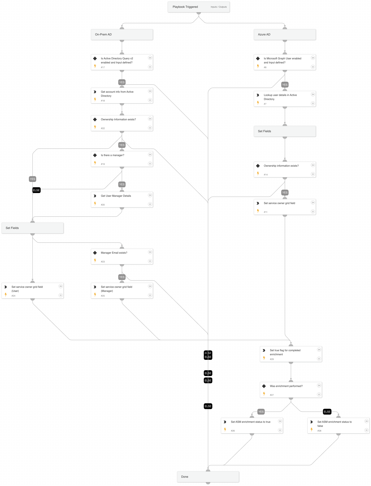
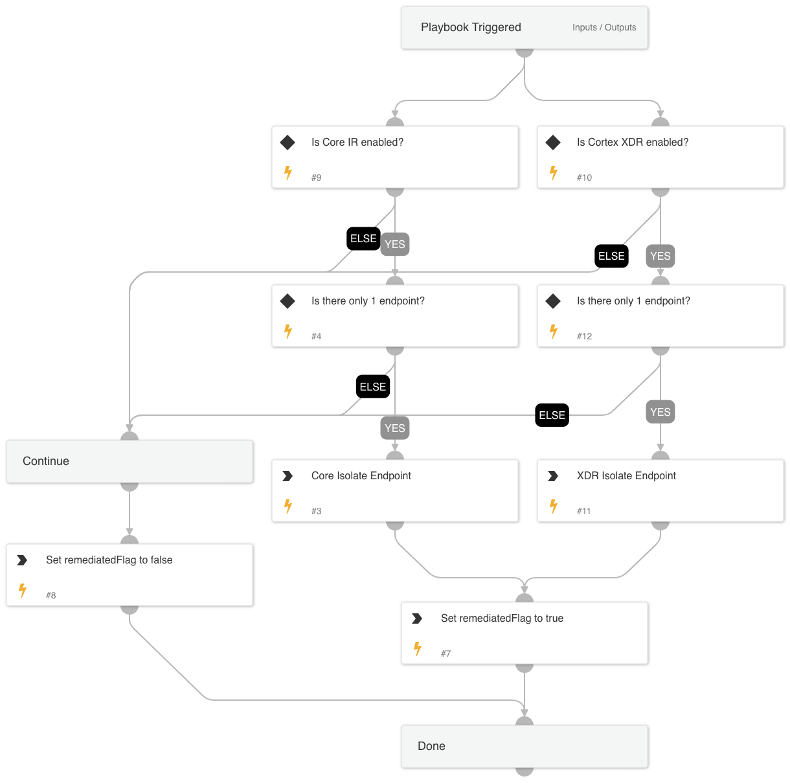
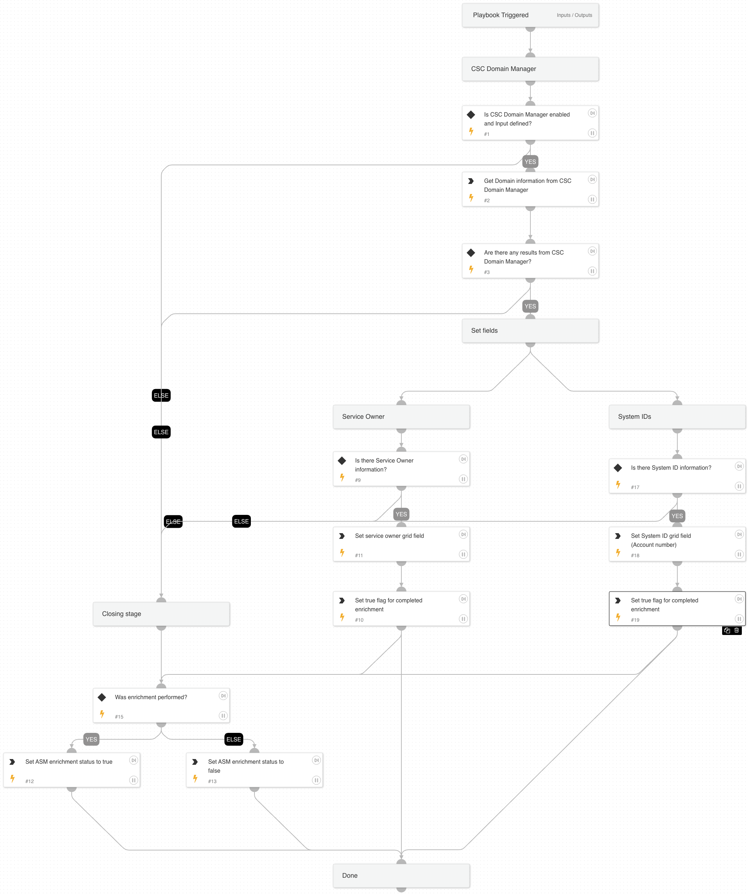
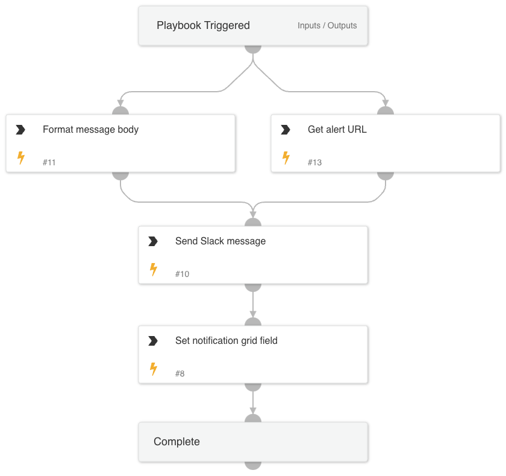
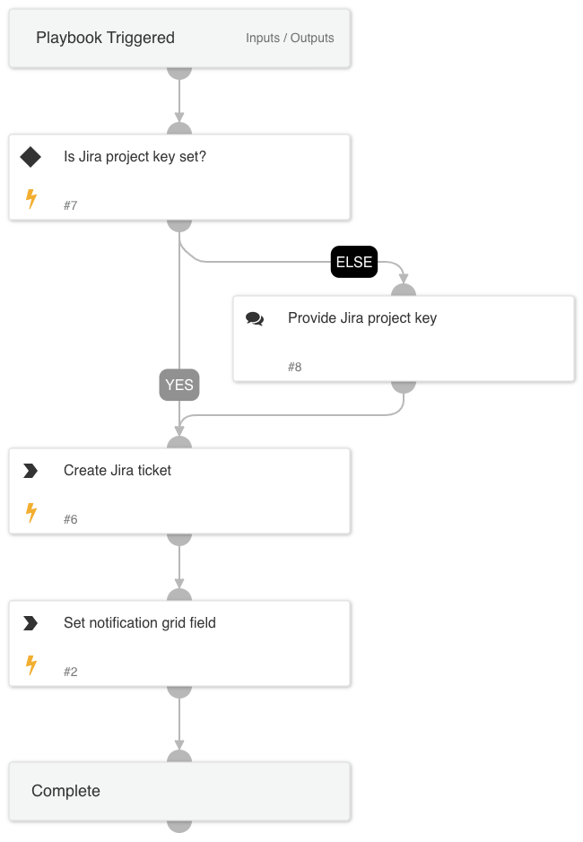
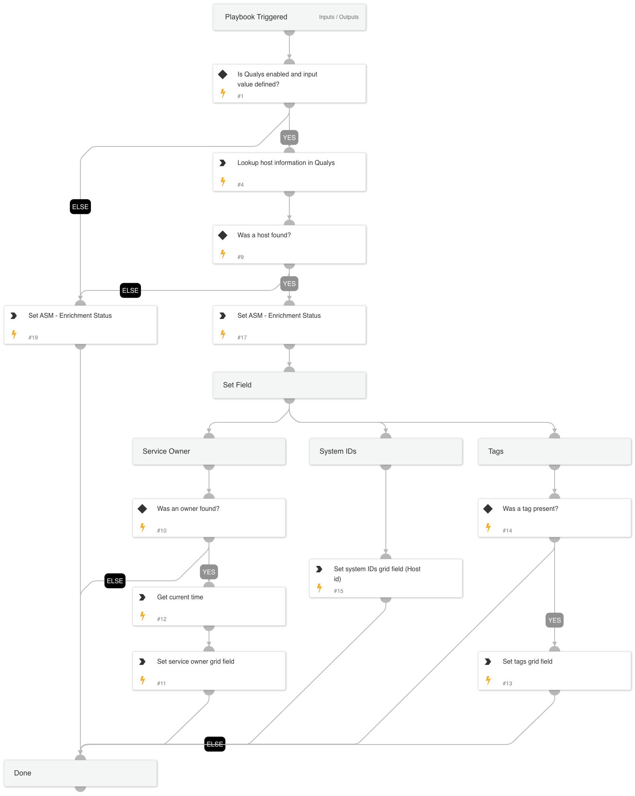
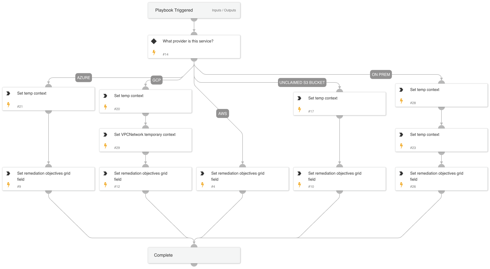
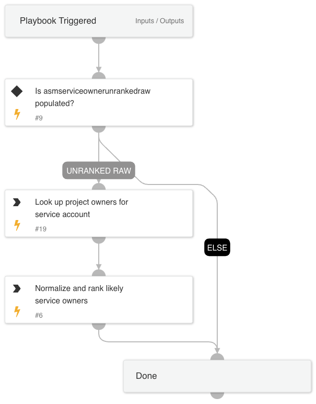
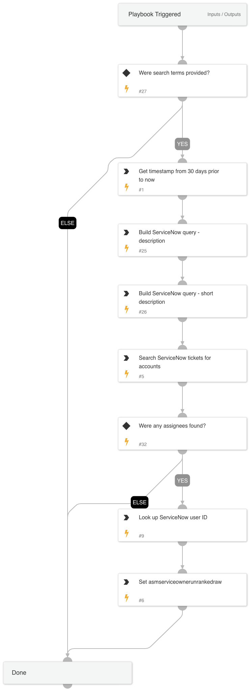
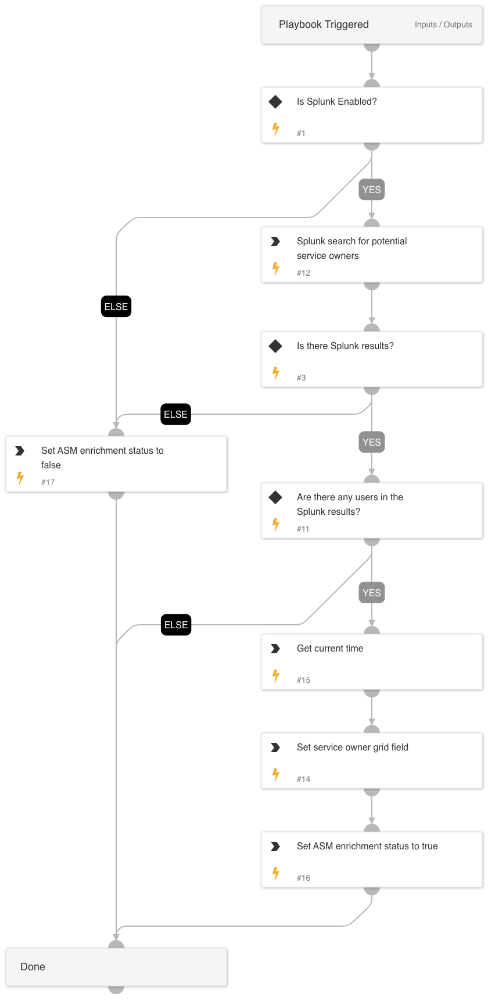

The **Cortex Attack Surface Management** pack is supported by Cortex Xpanse Expander and the (Attack Surface Management) ASM module for Cortex XSIAM.

[Cortex Xpanse](https://www.paloaltonetworks.com/cortex/cortex-xpanse) Expander and the Attack Surface Management (ASM) module for [Cortex XSIAM](https://www.paloaltonetworks.com/cortex/cortex-xsiam) are both best in class External Attack Surface Management solutions that strive to proactively reduce the frequency and severity of security incidents caused by internet-exposed risks. These solutions deliver comprehensive attack surface visibility by combining thorough, ML-enhanced asset attribution with continuous attack surface assessment. Any discovered risks are prioritized using contextual information and exploitability data, and findings are actioned through curated, automated playbooks to investigate, remediate, and summarize every new alert.

## What does this pack do?

This pack contains all of the integrations, automations, and playbooks necessary to fully automate the investigation, remediation, verification, and reporting on ASM risks within Cortex Xpanse Expander and Cortex XSIAM. Currently our pack:

- Enriches services, assets, and alerts based on out-of-the-box integrations with sources like CMDBs, Cloud Service Providers, VM solutions, and more.
- Uses ML assisted analysis to identify critical context useful for analyst decision making.
- Keeps human analysts in the loop to direct the desired remediation action depending on the type of risk and discovered context.
- Includes automated notification and ticket creation workflows for delegating remediation tasks to the appropriate service owners.
- Includes full automated remediation options for automatically removing risky services from the public internet.
- Sends out a notification to identified service owners via email about the remediation action taken.
- Supports validation re-scanning to ensure that remediation efforts have been applied successfully.
- Includes PDF reporting capabilities for preserving and communicating the investigation summary.

## How to use it?

The Active Response playbook contains a set of sub-playbooks, which support many different remediation paths that can be taken depending on the types of configured integrations, the type of alert, and input provided by the analyst.

For setting up the Active Response module for Xpanse, [a guide on how to configure the Active Response module can we found here.](https://docs-cortex.paloaltonetworks.com/r/Cortex-XPANSE/Cortex-Xpanse-Expander-User-Guide/Set-Up-Active-Response)

Aditionally, [a list of integrations used for the Active Response playbook can be found here](https://docs-cortex.paloaltonetworks.com/r/Cortex-XPANSE/Cortex-Xpanse-Expander-User-Guide/Automated-Remediation-Capabilities-Matrix?section=UUID-0a5dcbc2-d5ab-fa4e-5efc-599daac8b39b_table-idm4546555537995233526554598204). These are needed for different enrichment and remediation possibilities.

### Demo Video

### Automated Remediation Requirements

Automated remediation is only possible when the right conditions are met.  These are the current requirements:

- One of the following attack surface rule IDs:
  - Insecure OpenSSH**
  - Kubernetes Control Plane Component
  - LDAP Server
  - NetBIOS Name Server
  - NFS Rpcbind Server
  - OpenSSH
  - Rpcbind Server
  - SMB Server
  - SSH Server
  - SSH Terrapin Attack
  - SNMP Server
  - RDP Server
  - Telnet Server
  - Unencrypted FTP Server
  - Mysql Server
  - Mongo Server
  - Postgres Server
  - Elasticsearch Server
  - TFTP Server
  - Libssh
  - Insecure Bitvise SSH Server
  - Insecure SFTPGo
  - Unclaimed S3 Bucket*
- Asset one of the following:
  - AWS EC2 Instance
  - AWS Systems manager agent (active) on AWS EC2 Instance*
  - Azure Compute Instance
  - GCP Compute Engine (VM)
  - On-prem asset protected with a Palo Alto Networks Firewall
  - An asset that is not one of the above, but is protected by Cortex Endpoint Security (XSIAM/XDR)
- Service owner information found through one of the following:
  - Active Directory
  - AWS IAM
  - Azure IAM
  - Cortex Endpoint (XSIAM/XDR)
  - CSC Domain Manager
  - Email addresses found in tags
  - GCP IAM
  - Prisma Cloud
  - Qualys
  - Rapid7 InsightVM (Nexpose)
  - Splunk
  - ServiceNow CMDB
  - ServiceNow ITSM
  - Tenable.io Assets
  - Venafi
- Indicators of a non-production host:
  - "dev" or related words found in environment-related tags associated with the asset (case insensitive)
  - Has an active "DevelopmentEnvironment" classification from processing of public data
  - Optional: this check can be disabled with the `BypassDevCheck` parent playbook input

\* The `Unclaimed S3 Bucket` attack surface rule ID only requires `AWS-S3` integration to be enabled.

\*\* Patching using AWS Systems manager requires agent to be installed on the EC2 instance and currently we only support InsecureOpenSSH and OS versions of Linux Ubuntu.

## What is included in this pack?

The main active response playbook is the `Cortex ASM - ASM Alert` playbook. This playbook contains a set of sub-playbooks and automation scripts, which support many different remediation paths that can be taken depending on the types of configured integrations, the type of alert, and input provided by the analyst. After the final stage, the alert is resolved.

- Playbooks
  - [Cortex ASM - Active Directory Enrichment](#cortex-asm---active-directory-enrichment)
  - [Cortex ASM - ASM Alert](#cortex-asm---asm-alert)
  - [Cortex ASM - AWS Enrichment](#cortex-asm---aws-enrichment)
  - [Cortex ASM - Azure Enrichment](#cortex-asm---azure-enrichment)
  - [Cortex ASM - Certificate Enrichment](#cortex-asm---certificate-enrichment)
  - [Cortex ASM - Cortex Endpoint Enrichment](#cortex-asm---cortex-endpoint-enrichment)
  - [Cortex ASM - Cortex Endpoint Remediation](#cortex-asm---cortex-endpoint-remediation)
  - [Cortex ASM - Domain Enrichment](#cortex-asm---domain-enrichment)
  - [Cortex ASM - Detect Service](#cortex-asm---detect-service)
  - [Cortex ASM - Email Notification](#cortex-asm---email-notification)
  - [Cortex ASM - Enrichment](#cortex-asm---enrichment)
  - [Cortex ASM - GCP Enrichment](#cortex-asm---gcp-enrichment)
  - [Cortex ASM - Instant Message](#cortex-asm---instant-message)
  - [Cortex ASM - Jira Notification](#cortex-asm---jira-notification)
  - [Cortex ASM - On Prem Enrichment](#cortex-asm---on-prem-enrichment)
  - [Cortex ASM - On Prem Remediation](#cortex-asm---on-prem-remediation)
  - [Cortex ASM - Prisma Cloud Enrichment](#cortex-asm---prisma-cloud-enrichment)
  - [Cortex ASM - Qualys Enrichment](#cortex-asm---qualys-enrichment)
  - [Cortex ASM - Rapid7 Enrichment](#cortex-asm---rapid7-enrichment)
  - [Cortex ASM - Remediation Confirmation Scan](#cortex-asm---remediation-confirmation-scan)
  - [Cortex ASM - Remediation Guidance](#cortex-asm---remediation-guidance)
  - [Cortex ASM - Remediation Objectives](#cortex-asm---remediation-objectives)
  - [Cortex ASM - Remediation Path Rules](#cortex-asm---remediation-path-rules)
  - [Cortex ASM - Remediation](#cortex-asm---remediation)
  - [Cortex ASM - Service Ownership](#cortex-asm---service-ownership)
  - [Cortex ASM - ServiceNow CMDB Enrichment](#cortex-asm---servicenow-cmdb-enrichment)
  - [Cortex ASM - ServiceNow ITSM Enrichment](#cortex-asm---servicenow-itsm-enrichment)
  - [Cortex ASM - ServiceNow Notification](#cortex-asm---servicenow-notification)
  - [Cortex ASM - Splunk Enrichment](#cortex-asm---splunk-enrichment)
  - [Cortex ASM - Tenable.io Enrichment](#cortex-asm---tenableio-enrichment)
- Automation Scripts
  - [GenerateASMReport](#generateasmreport)
  - [GetProjectOwners](#getprojectowners)
  - [RankServiceOwners](#rankserviceowners)
  - [RemediationPathRuleEvaluation](#remediationpathruleevaluation)
- Layouts
  - [ASM Alert Layout](#asmalertlayout)

### Playbooks

#### Cortex ASM - Active Directory Enrichment

A playbook that given the email address enriches Service owner in Azure  and On-Prem directory.

#### Cortex ASM - ASM Alert

A playbook that enriches asset information for ASM alerts and provides the means for remediation.

#### Cortex ASM - AWS Enrichment

A playbook that given the IP address enriches AWS information relevant to ASM alerts.

#### Cortex ASM - Azure Enrichment

A playbook that given the IP address enriches Azure information relevant to ASM alerts.

#### Cortex ASM - Certificate Enrichment

A playbook to enrich certificate information.

#### Cortex ASM - Cortex Endpoint Enrichment

This playbook is used to pull information from Cortex Endpoint (XSIAM/XDR) systems for enrichment purposes.

#### Cortex ASM - Cortex Endpoint Remediation

This playbook is used for remediating a single exposed Cortex Endpoint (XSIAM/XDR) by isolating the endpoint from the network using the "Isolate Endpoint" feature in XSIAM ([see XSIAM details](https://docs-cortex.paloaltonetworks.com/r/Cortex-XSIAM/Cortex-XSIAM-Administrator-Guide/Isolate-an-Endpoint)) and XDR ([see XDR details](https://docs-cortex.paloaltonetworks.com/r/Cortex-XDR/Cortex-XDR-Pro-Administrator-Guide/Isolate-an-Endpoint)). 

#### Cortex ASM - Domain Enrichment

This playbook is used for enriching domain information.

#### Cortex ASM - Detect Service

A playbook that utilizes the Remediation Confirmation Scan service to check for mitigated vulnerabilities.

#### Cortex ASM - Email Notification

A playbook that is used to send email notifications to service owners to notify them of their internet exposures.

#### Cortex ASM - Enrichment

A playbook that is used as a container folder for all enrichments of ASM alerts.

#### Cortex ASM - GCP Enrichment

A playbook that given the IP address enriches GCP information relevant to ASM alerts.

#### Cortex ASM - Instant Message

A playbook that is used to create instant messages toward service owners to notify them of their internet exposures.

#### Cortex ASM - Jira Notification

A playbook that is used to create Jira tickets directed toward service owners to notify them of their internet exposures.

#### Cortex ASM - On Prem Enrichment

A playbook that given an IP address, port, and protocol of a service, enriches using on-prem integrations to find the related firewall rule and other related information.

#### Cortex ASM - On Prem Remediation

A playbook that adds new block rule(s) to on-prem firewall vendors in order to block internet access for internet exposures.

#### Cortex ASM - Prisma Cloud Enrichment

Playbook that given the IP address enriches Prisma Cloud information relevant to ASM alerts.

#### Cortex ASM - Qualys Enrichment

Playbook that given the IP address enriches Qualys information relevant to ASM alerts.

#### Cortex ASM - Rapid7 Enrichment

A playbook that given the IP address enriches Rapid7 information relevant to ASM alerts.

#### Cortex ASM - Remediation Confirmation Scan

A playbook that creates an ASM Remediation Confirmation Scan using an existing service ID, if the scan does not already exist;. It then polls for results of a scan.

#### Cortex ASM - Remediation Guidance

A playbook that pulls remediation guidance off of a list based on ASM RuleID to be used in service owner notifications (email or ticketing system).

#### Cortex ASM - Remediation Objectives

A playbook that populates the remediation objectives field that is used to display the remediation actions to the end user.

#### Cortex ASM - Remediation Path Rules

A playbook that returns "RemediationAction" options based on the return from the Remediation Path Rules API, or defaults to data collection task options from the "Cortex ADM - Decision" sub-playbook.

#### Cortex ASM - Remediation

A playbook that is used as a container folder for all remediation of ASM alerts.

#### Cortex ASM - Service Ownership

Playbook that identifies and recommends the most likely owners of a given service.

#### Cortex ASM - ServiceNow CMDB Enrichment

A playbook that given the IP address enriches ServiceNow CMDB information relevant to ASM alerts.

#### Cortex ASM - ServiceNow ITSM Enrichment

A playbook that given the search terms enriches ServiceNow ITSM service owner information relevant to ASM alerts.

#### Cortex ASM - ServiceNow Notification

A playbook that is used to create ServiceNow tickets directed toward service owners to notify them of their internet exposures.

#### Cortex ASM - Splunk Enrichment

A playbook that given the IP address enriches Splunk information relevant to ASM alerts.

#### Cortex ASM - Tenable.io Enrichment

A playbook that given the IP address enriches Tenable.io information relevant to ASM alerts.

### Automation Scripts

#### GenerateASMReport

An automation used to generate an ASM alert summary report with important information found via the playbook run.

#### InferWhetherServiceIsDev

An automation that identifies whether the service is a "development" server. Development servers have no external users and run no production workflows. These servers might be named "dev", but they might also be named "qa", "pre-production", "user acceptance testing", or use other non-production terms. This automation uses both public data visible to anyone (`active_classifications` as derived by Xpanse ASM) as well as checking internal data for AI-learned indicators of development systems (`asm_tags` as derived from integrations with non-public systems).

#### RankServiceOwners

An automation that recommends the most likely service owners from those surfaced by Cortex ASM Enrichment and updates content.

#### GetProjectOwners

This automation parses a GCP service account email for the project ID, then looks up the project owners and adds them to a list of potential service owners for ranking.

#### RemediationPathRuleEvaluation

An automation that is used to find a matching remediation path rule based on criteria.  If multiple rules match, it will return the most recently created rule.  This assumes that the rules passed in are filtered to correlate with the alert's attack surface rule (Xpanse only).

### Layouts

#### ASM Alert Layout

This layout is provides enrichment information such as system IDs, tags, and service owners for a given Attack Surface Management alert.
