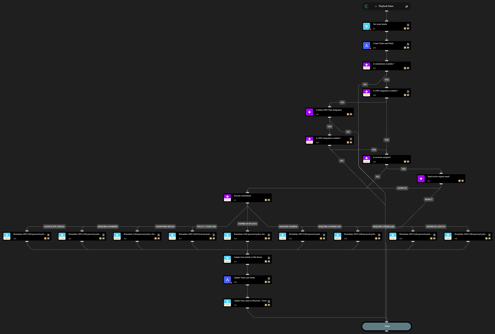

This playbook remediates cloud security misconfigurations related an AWS IAM Password Policy while allowing you to engage relevant stakeholders by creating tickets and notifying team members using your preferred ticketing and notification services. With this playbook, you can choose to fully automate the remediation or have an analyst-in-the-loop review and approval step before remediating the issue. It uses a sub-playbook for the ticketing and notification tasks which require you to configure the required integrations. To run this playbook, you must first provide a set of inputs to select your preferred ticketing and notification channels. To include an analyst-in-the-loop approval step, you must provide an email address of the reviewer. The playbook is designed to check for this email address in order to send the issue details and ask for a decision from the approver before applying the recommended fix. 

Caution: If no reviewer email is provided, then the playbook will proceed with applying the fix without an approval step.

The following misconfigurations can be remediated through this playbook.

- AWS IAM password policy allows password reuse
- AWS IAM password policy does not expire in 90 days
- AWS IAM password policy does not have a lowercase character
- AWS IAM password policy does not have a minimum of 14 characters
- AWS IAM password policy does not have a number
- AWS IAM password policy does not have a symbol
- AWS IAM password policy does not have a uppercase character
- AWS IAM password policy does not have password expiration period
- AWS IAM Password policy is unsecure

## Dependencies

This playbook uses the following sub-playbooks, integrations, and scripts.

### Sub-playbooks

* Create Ticket and Notify

### Integrations

* AWS
* Cortex Core - IR

### Scripts

* IsIntegrationAvailable
* Print

### Commands

* aws-iam-account-password-policy-update
* core-get-asset-details
* setIssueStatus

## Playbook Inputs

---

| **Name** | **Description** | **Default Value** | **Required** |
| --- | --- | --- | --- |
| Preferred ticketing platform | Accepted values  - Jira - ServiceNow - Both  Note: Leaving this blank will prevent issue ticket from being generated and the playbook will skip this step. |  | Optional |
| Preferred notification platform | Accepted values  - Microsoft Teams - Slack  Note: Leaving this blank will prevent sending notification message and the playbook will skip this step. |  | Optional |
| Notification email recipients | Provide the email address to send email notification.  Note: Leaving this blank will prevent sending email notification and the playbook will skip this step. |  | Optional |
| Reviewer email address | Provide the designated reviewer's email address to request approval for executing the remediation command.  Note: Leaving this blank will prevent sending an email notification for reviewer approval, and the playbook will skip this step to proceed executing the remediation command. |  | Optional |
| Jira project key | Provide Jira project key where the issue will be created. |  | Optional |
| Teams Channel Name | Provide Microsoft Teams channel name to which to send messages. |  | Optional |
| Slack Channel Name | Provide Slack channel name to which to send messages. |  | Optional |

## Playbook Outputs

---
There are no outputs for this playbook.

## Playbook Image

---

