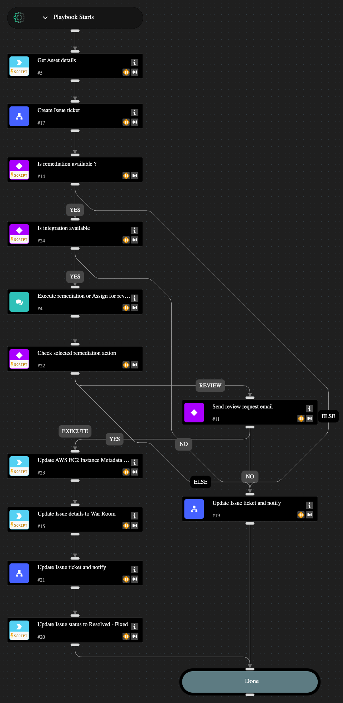

This playbook remediates cloud security misconfigurations related to an AWS EC2 Instance. You can choose to fully automate the remediation or have an analyst-in-the-loop review and approval step before remediating the issue. The following misconfigurations can be remediated through this playbook.

- AWS EC2 instance not configured with Instance Metadata Service v2 (IMDSv2)

## Dependencies

This playbook uses the following sub-playbooks, integrations, and scripts.

### Sub-playbooks

* Create Issue ticket
* Update Issue ticket and notify

### Integrations

* AWS

### Scripts

* IsIntegrationAvailable
* Print

### Commands

* aws-ec2-instance-metadata-options-modify
* core-get-asset-details
* setIssueStatus

## Playbook Inputs

---
There are no inputs for this playbook.

## Playbook Outputs

---
There are no outputs for this playbook.

## Playbook Image

---

