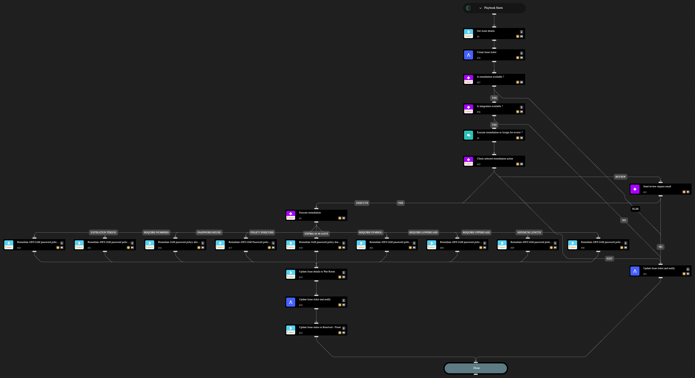

This playbook remediates cloud security misconfigurations related an AWS IAM Password Policy. You can choose to fully automate the remediation or have an analyst-in-the-loop review and approval step before remediating the issue. The following misconfigurations can be remediated through this playbook

- AWS IAM password policy allows password reuse
- AWS IAM password policy does not expire in 90 days
- AWS IAM password policy does not have a lowercase character
- AWS IAM password policy does not have a minimum of 14 characters
- AWS IAM password policy does not have a number
- AWS IAM password policy does not have a symbol
- AWS IAM password policy does not have a uppercase character
- AWS IAM password policy does not have password expiration period
- AWS IAM Password policy is insecure

## Dependencies

This playbook uses the following sub-playbooks, integrations, and scripts.

### Sub-playbooks

* Create Issue ticket
* Update Issue ticket and notify

### Integrations

* AWS
* Cortex Core - IR

### Scripts

* IsIntegrationAvailable
* Print

### Commands

* aws-iam-account-password-policy-update
* core-get-asset-details
* setIssueStatus

## Playbook Inputs

---
There are no inputs for this playbook.

## Playbook Outputs

---
There are no outputs for this playbook.

## Playbook Image

---

