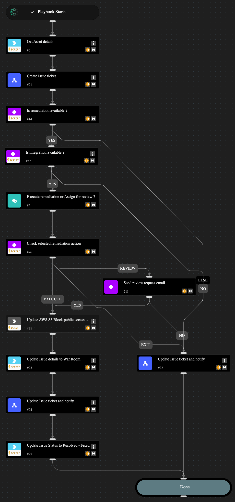

This playbook remediates cloud security misconfigurations related  to an AWS S3 Bucket. You can choose to fully automate the remediation or have an analyst-in-the-loop review and approval step before remediating the issue. The following misconfigurations can be remediated through this playbook.

- AWS S3 bucket publicly readable
- AWS S3 bucket publicly writable

## Dependencies

This playbook uses the following sub-playbooks, integrations, and scripts.

### Sub-playbooks

* Create Issue ticket
* Update Issue ticket and notify

### Integrations

* AWS
* Cortex Core - IR

### Scripts

* IsIntegrationAvailable
* Print

### Commands

* aws-s3-public-access-block-update
* core-get-asset-details
* setIssueStatus

## Playbook Inputs

---
There are no inputs for this playbook.

## Playbook Outputs

---
There are no outputs for this playbook.

## Playbook Image

---

