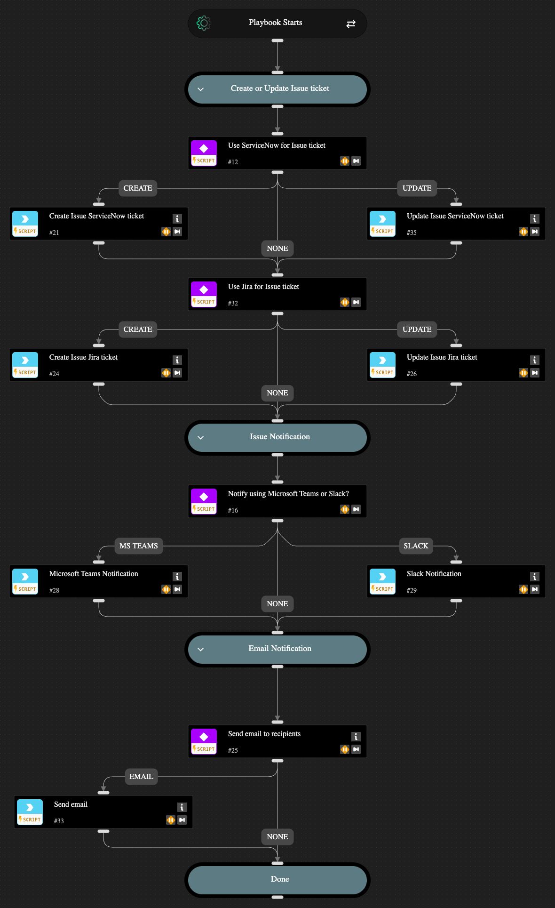

This playbook automates the dispatching of issues through ServiceNow or Jira and notifies stakeholders via Slack, MS Teams, and/or email. With this playbook you can choose to create or update a ticket using Jira or ServiceNOW, notify other teams using Slack or MS Teams, and/or by sending an Email. It gives you the flexibility to create a ticket only and skip the notification step, skip the creation of a ticket and notify only, or choose to create a ticket and notify stakeholders. The playbook checks for and requires existing Jira, ServiceNOW, Slack, or MS Teams integrations to perform the ticketing and notification actions. If none of these integrations are found in your account, then the playbook sends an email with the issue details to the selected issue owner. 

## Dependencies

This playbook uses the following sub-playbooks, integrations, and scripts.

### Sub-playbooks

This playbook does not use any sub-playbooks.

### Integrations

* Jira V3
* Microsoft Teams
* ServiceNow v2
* SlackV3
* mail-sender

### Scripts

This playbook does not use any scripts.

### Commands

* jira-create-issue-quick-action
* jira-edit-issue
* send-mail
* send-notification
* servicenow-create-ticket-quick-action
* servicenow-update-ticket

## Playbook Inputs

---

| **Name** | **Description** | **Default Value** | **Required** |
| --- | --- | --- | --- |
| Preferred ticketing platform | Accepted values  - Jira - ServiceNow - Both - None |  | Optional |
| Preferred notification platform  | Accepted values  - Teams - Slack - Both - None |  | Optional |
| Notification email recipients  | Enter the email addresses to notify, or type 'None' if no notification is needed. |  | Optional |
| Asset details | Issue Asset details |  | Optional |
| Issue State | Controls Issue creation and updation flow Accepted values  - Create - Update |  | Optional |

## Playbook Outputs

---
There are no outputs for this playbook.

## Playbook Image

---

