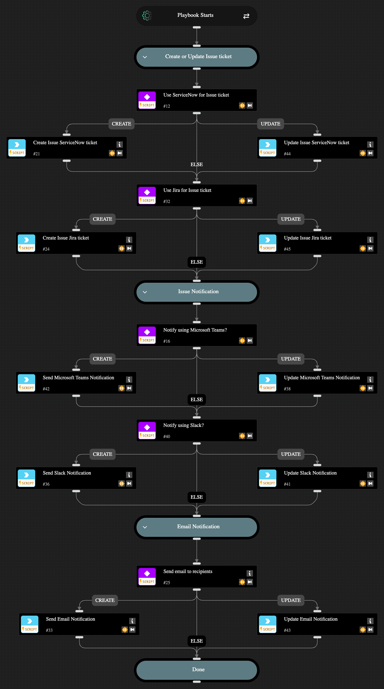

This playbook automates the handling of issues, sending them through ServiceNow v2 or Jira v3 and notifying stakeholders via Slack v3, Microsoft Teams, or email. You have the flexibility to create or update a ticket using Jira or ServiceNow, to notify other teams using Slack or Microsoft Teams, or to send an email. You can choose to only create or update a ticket and skip the notification, skip creating or updating a ticket and send only a notification, or both create or update a ticket and notify relevant parties. This playbook requires existing integrations with Jira, ServiceNow, Slack, or Microsoft Teams to perform these actions. If none of these integrations are found in your account, the playbook will send an email with the issue details directly to the selected issue owner.

## Dependencies

This playbook uses the following sub-playbooks, integrations, and scripts.

### Sub-playbooks

This playbook does not use any sub-playbooks.

### Integrations

* Jira V3
* Microsoft Teams
* ServiceNow v2
* SlackV3
* mail-sender

### Scripts

This playbook does not use any scripts.

### Commands

* jira-create-issue-quick-action
* jira-issue-add-comment
* send-mail
* servicenow-create-ticket-quick-action
* servicenow-update-ticket
* slack-send-notification-quick-action
* teams-send-notification-quick-action

## Playbook Inputs

---

| **Name** | **Description** | **Default Value** | **Required** |
| --- | --- | --- | --- |
| Preferred ticketing platform | Possible values: - Jira - ServiceNow - Both  Note: If you leave this empty, no issue ticket will be generated, and the playbook will skip this step. |  | Optional |
| Preferred notification platform | Possible values: - Microsoft Teams - Slack  Note: If you leave this blank, no notification message will be sent and the playbook will skip this step. |  | Optional |
| Notification email recipients | Provide the email address to send email notifications.  Note: If you leave this blank, no email notification will be sent and the playbook will skip this step. |  | Optional |
| System Input - Asset details | Note: No input is required here; issue asset details will be automatically pulled from the remediation playbook. |  | Optional |
| System Input - Issue State | Note: No input is required here; issue state value will be automatically entered from the remediation playbook. |  | Optional |
| System Input -ServiceNow Ticket ID | Note: No input is required here; ServiceNow ticket ID will be automatically pulled from the remediation playbook. |  | Optional |
| System Input -Jira Ticket ID | Note: No input is required here; Jira ticket ID will be automatically pulled from the remediation playbook. |  | Optional |
| Jira Project Key | Provide Jira project key where the issue will be created. |  | Optional |
| Teams Channel Name | Provide Microsoft Teams channel name to which to send messages. |  | Optional |
| Slack Channel Name | Provide Slack channel name to which to send messages. |  | Optional |

## Playbook Outputs

---

| **Path** | **Description** | **Type** |
| --- | --- | --- |
| Ticket.Id | Jira Ticket ID. | string |
| ServiceNow.Ticket.ID | Service Now Ticket ID. | string |

## Playbook Image

---

