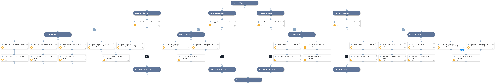

This playbook queries Strata Logging Service (SLS) for traffic indicators, including IP addresses, geolocations, URLs, domains, and ports.

Note that multiple search values should be separated by commas only (without spaces or any special characters).

## Dependencies
This playbook uses the following sub-playbooks, integrations, and scripts.

### Sub-playbooks
This playbook does not use any sub-playbooks.

### Integrations
* Strata Logging Service

### Scripts
* SetAndHandleEmpty

### Commands
* cdl-query-file-data
* cdl-query-threat-logs
* cdl-query-traffic-logs
* cdl-query-url-logs

## Playbook Inputs
---

| **Name** | **Description** | **Default Value** | **Required** |
| --- | --- | --- | --- |
| IPAddresses | A single or multiple IP addresses to search for within Strata Logging Service. Used for both source and destination IP addresses.  Separate multiple search values by commas only \(without spaces or any special characters\). |  | Optional |
| URLDomain | Single or multiple URLs and/or domains to search for  within Strata Logging Service.  Separate multiple search values by commas only \(without spaces or any special characters\). |  | Optional |
| Geolocation | A single or multiple country names or codes to search for  within Strata Logging Service. Used for both source and destination geolocations.  Separate multiple search values by commas only \(without spaces or any special characters\). |  | Optional |
| PortNumber | A single or multiple IP addresses to search for within Strata Logging Service. Used for both source and destination ports.  Separate multiple search values by commas only \(without spaces or any special characters\). |  | Optional |
| time_range | An alternative to the 'start_time' and 'end_time' inputs that indicates the timeframe for the search, e.g. 1 week, 1 day, 30 minutes.  When the time_range input is specified, the 'start_time' and 'end_time' inputs should not be used. |  | Optional |
| start_time | Specify the query start time at which to perform a search within Strata Logging Service.  For example, start_time="2018-04-26 00:00:00" |  | Optional |
| end_time | Specify the query end time at which to perform a search within Strata Logging Service.  For example, end_time="2018-04-26 00:00:00" |  | Optional |
| limit | The maximum number of logs to return.  Default is 10. |  | Optional |
| fields | Select the fields you wish to be included in the query results.  Selection can be "all" \(same as \*\) or a comma-separated list of specific fields in the table.  Separate multiple search values by commas only \(without spaces or any special characters\). |  | Optional |
| FirewallAction | Filter network traffic logs that should be retrieved from Strata Logging Service based on firewall action.  Separate multiple search values by commas only \(without spaces or any special characters\). |  | Optional |
| rule_matched | Filter network traffic logs to be retrieved from Strata Logging Service based on security policy rule names that the network traffic matches.  Separate multiple search values by commas only \(without spaces or any special characters\). |  | Optional |

## Playbook Outputs
---

| **Path** | **Description** | **Type** |
| --- | --- | --- |
| CDL.HuntingResults | Event log objects and fields that were retrieved from Strata Logging Service \(SLS\). | string |
| CDL.HuntingResults.TimeGenerated | Time when the log was generated on the firewall's data plane. | number |
| CDL.HuntingResults.LogTime | Time the log was received in Strata Logging Service. | number |
| CDL.HuntingResults.IngestionTime | Ingestion time of the log. | number |
| CDL.HuntingResults.App | The application associated with the network traffic. | string |
| CDL.HuntingResults.AppCategory | Identifies the high-level family of the application. | string |
| CDL.HuntingResults.RiskOfApp | Indicates how risky the application is from a network security perspective. | string |
| CDL.HuntingResults.CharacteristicOfApp | Identifies the behavioral characteristic of the application associated with the network traffic. | string |
| CDL.HuntingResults.SessionID | Identifies the firewall's internal identifier for a specific network session. | string |
| CDL.HuntingResults.Action | Identifies the action that the firewall took for the network traffic. | string |
| CDL.HuntingResults.Protocol | The IP protocol associated with the session. | string |
| CDL.HuntingResults.RefererProtocol | The protocol used in the HTTP Referer header field. | string |
| CDL.HuntingResults.DestinationPort | The network traffic's destination port. If this value is 0, then the app is using its standard port. | number |
| CDL.HuntingResults.SourcePort | The source port utilized by the session. | number |
| CDL.HuntingResults.RefererPort | The port used in the HTTP Referer header field. | number |
| CDL.HuntingResults.DestinationIP | The original destination IP address. | string |
| CDL.HuntingResults.SourceIP | The original source IP address. | string |
| CDL.HuntingResults.Users | Source/Destination user. If neither is available, source_ip is used. | string |
| CDL.HuntingResults.SrcUser | The username that initiated the network traffic. | string |
| CDL.HuntingResults.SrcUserInfo | The information for the initiated user. | string |
| CDL.HuntingResults.DstUser | The username to which the network traffic was destined. | string |
| CDL.HuntingResults.DstUserInfo | The destination user information. | string |
| CDL.HuntingResults.UserAgent | The web browser that the user used to access the URL. | string |
| CDL.HuntingResults.IsPhishing | Indicates whether enterprise credentials were submitted by an end user. | string |
| CDL.HuntingResults.SourceLocation | The source country or internal region for private addresses. | string |
| CDL.HuntingResults.DestinationLocation | The destination country or internal region for private addresses. | string |
| CDL.HuntingResults.RuleMatched | The unique identifier for the security policy rule that the network traffic matched. | string |
| CDL.HuntingResults.ThreatName | The name of the detected threat. | string |
| CDL.HuntingResults.LogSourceName | The name of the source of the log. | string |
| CDL.HuntingResults.Direction | Indicates the direction of the attack. | string |
| CDL.HuntingResults.DirectionOfAttack | Indicates the direction of the attack. | string |
| CDL.HuntingResults.FileName | The name of the file that is blocked. | string |
| CDL.HuntingResults.FileSHA256 | The binary hash \(SHA256\) of the file. | string |
| CDL.HuntingResults.FileType | Palo Alto Networks textual identifier for the threat. | string |
| CDL.HuntingResults.Url | The name of the internet domain that was visited in this session. | string |
| CDL.HuntingResults.Uri | The address of the URI. | string |
| CDL.HuntingResults.RefererURL | The URL used in the HTTP Referer header field. | string |
| CDL.HuntingResults.RefererFQDN | The full domain name used in the HTTP Referer header field. | string |
| CDL.HuntingResults.URLCategory | The URL category. | string |
| CDL.HuntingResults.URLDomain | The name of the internet domain that was visited in this session. | string |
| CDL.HuntingResults.IsUrlDenied | Indicates whether the session was denied due to a URL filtering rule. | string |
| CDL.HuntingResults.SourceDeviceHost | Hostname of the device from which the session originated. | string |
| CDL.HuntingResults.DestDeviceHost | Hostname of the device session destination. | string |
| CDL.HuntingResults.ContentType | The content type of the HTTP response data. | string |
| CDL.HuntingResults.HTTPMethod | The HTTP Method used in the web request | string |

## Playbook Image
---
