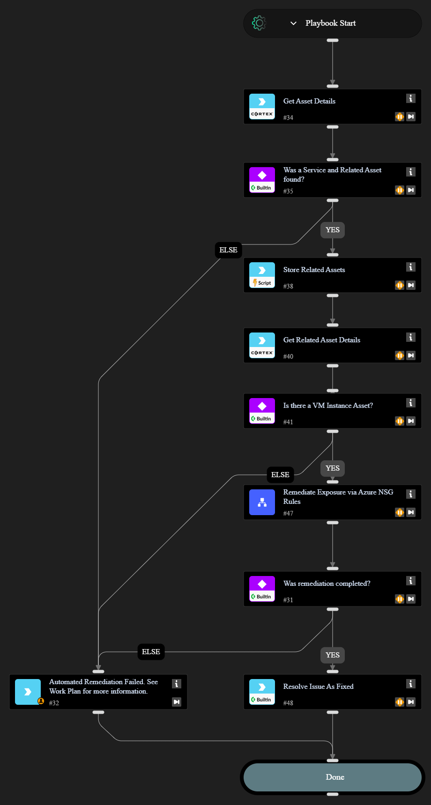

This playbook handles exposure issue remediation for cloud hosted Virtual Machines by modifying cloud network security settings to block public access to the exposed service port.

## Dependencies

This playbook uses the following sub-playbooks, integrations, and scripts.

### Sub-playbooks

* Remediate Exposure via Azure NSG Rules

### Integrations

* Cortex Core - Platform

### Scripts

* Set

### Commands

* core-get-asset-details
* setIssueStatus

## Playbook Inputs

---
There are no inputs for this playbook.

## Playbook Outputs

---
There are no outputs for this playbook.

## Playbook Image

---

