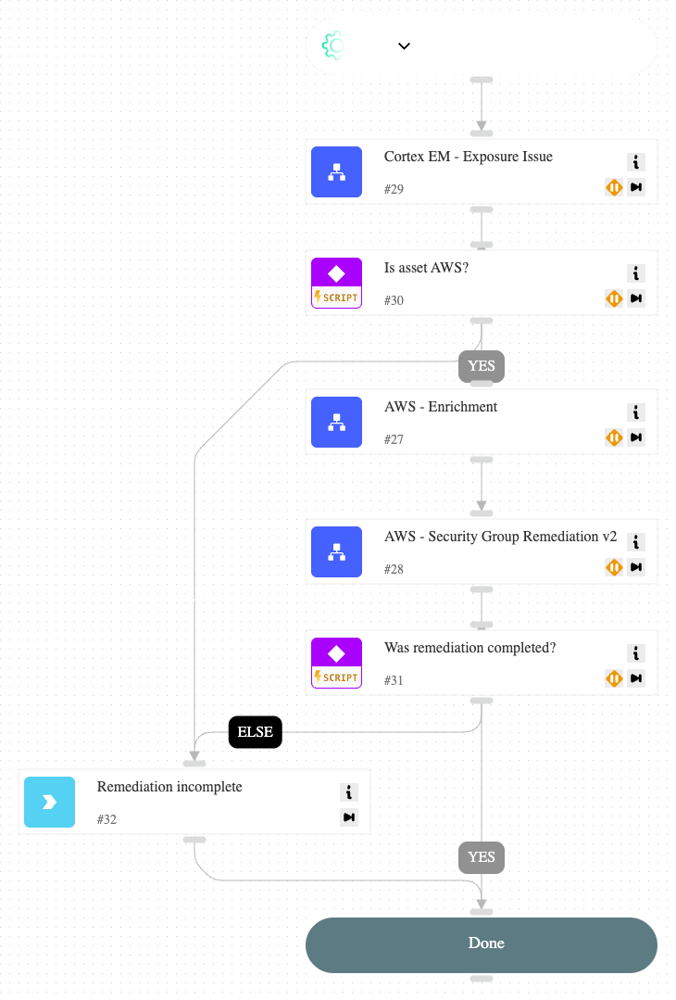

This playbook handles remediation of exposure issues.

## Dependencies

This playbook uses the following sub-playbooks, integrations, and scripts.

### Sub-playbooks

* AWS - Enrichment
* AWS - Security Group Remediation v2
* Cortex EM - Exposure Issue

### Integrations

This playbook does not use any integrations.

### Scripts

This playbook does not use any scripts.

### Commands

This playbook does not use any commands.

## Playbook Inputs

---

| **Name** | **Description** | **Default Value** | **Required** |
| --- | --- | --- | --- |
| AWSAssumeRoleName | If assuming roles for AWS, this is the name of the role to assume \(should be the same for all organizations\). |  | Optional |

## Playbook Outputs

---
There are no outputs for this playbook.

## Playbook Image

---

