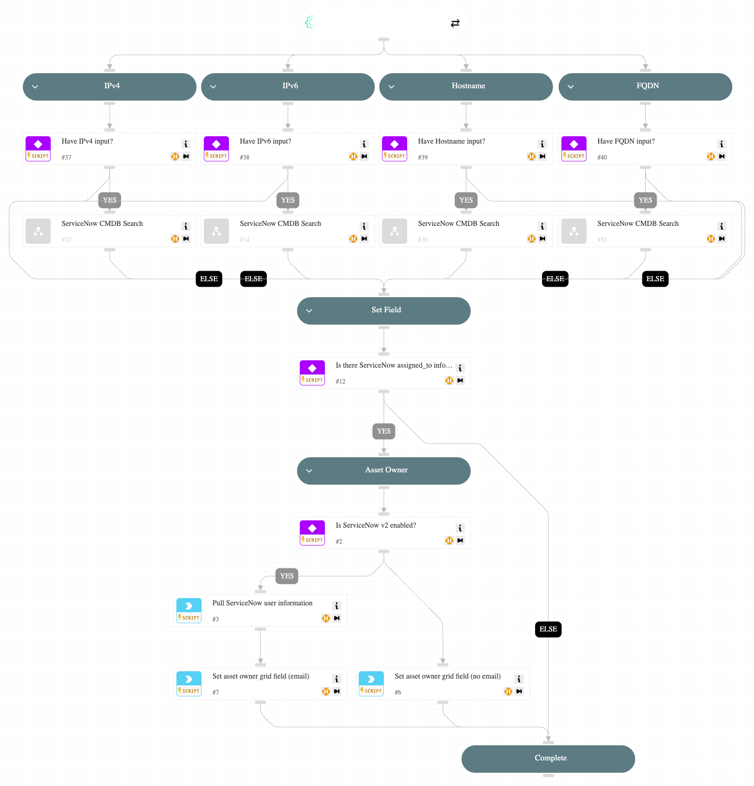

Given provided indicators (IPs, Hostnames, FQDNs, etc.) this playbook enriches ServiceNow CMDB information relevant to exposure issues.

## Dependencies

This playbook uses the following sub-playbooks, integrations, and scripts.

### Sub-playbooks

* ServiceNow CMDB Search

### Integrations

* ServiceNow v2

### Scripts

* ContextSetup

### Commands

* servicenow-query-users

## Playbook Inputs

---

| **Name** | **Description** | **Default Value** | **Required** |
| --- | --- | --- | --- |
| IPv4 | IPv4 address |  | Optional |
| IPv6 | IPv6 address |  | Optional |
| HostName | Hostname |  | Optional |
| FQDN | Fully Qualified Domain Name |  | Optional |

## Playbook Outputs

---

| **Path** | **Description** | **Type** |
| --- | --- | --- |
| vmassetownerunrankedraw | potential asset/remediation owners | unknown |

## Playbook Image

---

