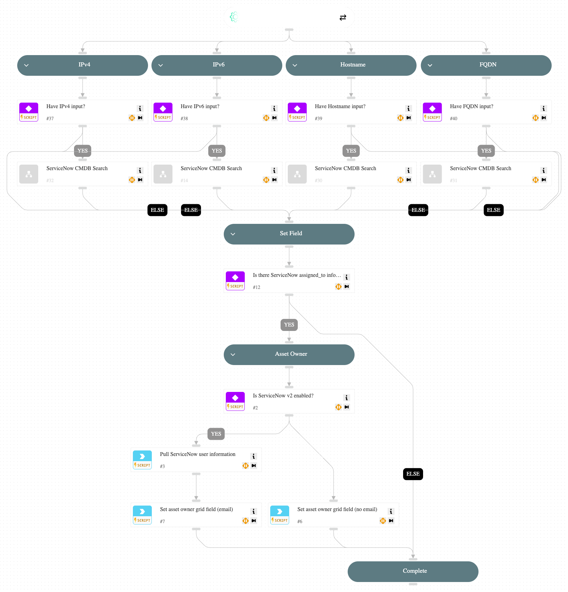

The **Cortex Exposure Management** pack is supported by the Cortex XSIAM Exposure Management module as well as the Attack Surface Management (ASM) module.

[Cortex XSIAM](https://www.paloaltonetworks.com/cortex/cortex-xsiam) is a new approach to security operations that drives dramatically better security outcomes by closely integrating and automating the capabilities and processes of a modern security operations center (SOC).

By leveraging the vulnerability detection capabilities present in many of the core and optional Cortex XSIAM add-ons, Cortex XSIAM is able to help organizations make sense of their vulnerability posture and take mitigating actions.

This pack further enhances these capabilities and facilitates exposure issue enrichment and response by providing playbooks and scripts that stitch together relevant investigation details such as the remediation owner and offering appropriate mitigation options to defenders.

## What does this pack do?

This pack uses integrations, automations, and playbooks to fully automate investigation, remediation, verification, and reporting on ASM risks in Cortex Xpanse Expander and Cortex XSIAM, including:

- Enriching services, assets, and alerts based on out-of-the-box integrations with sources such as CMDBs, Cloud Service Providers, and VM solutions.
- Remediating RdpServer/SshServer attack surface rules when present on an AWS EC2 instance.

## What is included in this pack?

The main Cortex Exposure Management playbook is the `Cortex EM - Exposure Issue` playbook, which includes several sub-playbooks that can handle various ways to assign remediation ownership. The path taken depends on your configured integrations and the issue's source.

- Playbooks
  - [Cortex EM - Exposure Issue](#cortex-em---exposure-issue)
  - [Cortex EM - ServiceNow CMDB](#cortex-em---servicenow-cmdb)
  - [Cortex EM - Remediation](#cortex-em---remediation)

### Playbooks

#### Cortex EM - Exposure Issue

This playbook handles exposure issues by enriching assets to find potential asset owners.

#### Cortex EM - ServiceNow CMDB

This playbook enriches ServiceNow CMDB data related to exposure issues by using provided indicators such as IPs, hostnames, and FQDNs.

#### Cortex EM - Remediation

This playbook handles exposure issue remediation.

