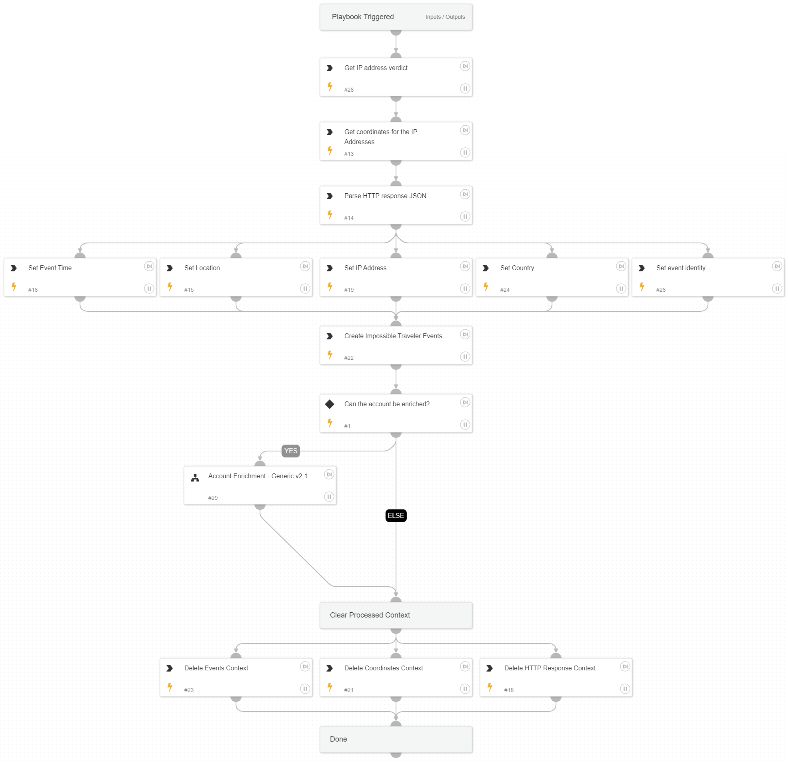

This playbook get as an input all of the involved IP addresses and identities from the Impossible Traveler playbook alert, and enriches them based on the following:
* Geo location
* Active Directory
* IP enrichment e.g. VirusTotal, AbuseIPDB, etc.

## Dependencies

This playbook uses the following sub-playbooks, integrations, and scripts.

### Sub-playbooks

* Account Enrichment - Generic v2.1

### Integrations

* CortexCoreIR
* CoreIOCs

### Scripts

* http
* Set
* DeleteContext
* ParseJSON

### Commands

* ip

## Playbook Inputs

---

| **Name** | **Description** | **Default Value** | **Required** |
| --- | --- | --- | --- |
| sourceip | The source IP to iterate over. |  | Optional |
| username | The username to iterate over. |  | Optional |
| domain | The organization domain. |  | Optional |

## Playbook Outputs

---

| **Path** | **Description** | **Type** |
| --- | --- | --- |
| ActiveDirectory.Users.manager | The manager of the user. | unknown |
| IP | The IP enrichment results. | unknown |
| IP.Geo | The IP geo information. | unknown |
| IP.Malicious | The IP verdict. | unknown |
| AbuseIPDB.IP | The IP information retrieved from AbuseIPDB. | unknown |
| AbuseIPDB.IP.Geo | The IP geo information. | unknown |
| DBotScore | The DBotScore | unknown |
| AbuseIPDB.IP.Malicious | The IP verdict. | unknown |
| Account | The account object. | unknown |
| ActiveDirectory.Users | The AD users. | unknown |
| MSGraphUser | The user information retrieved from MSGraphUser | unknown |
| MSGraphUserManager.Manager | The user's manager information retrieved from MSGraphUser. | unknown |

## Playbook Image

---

