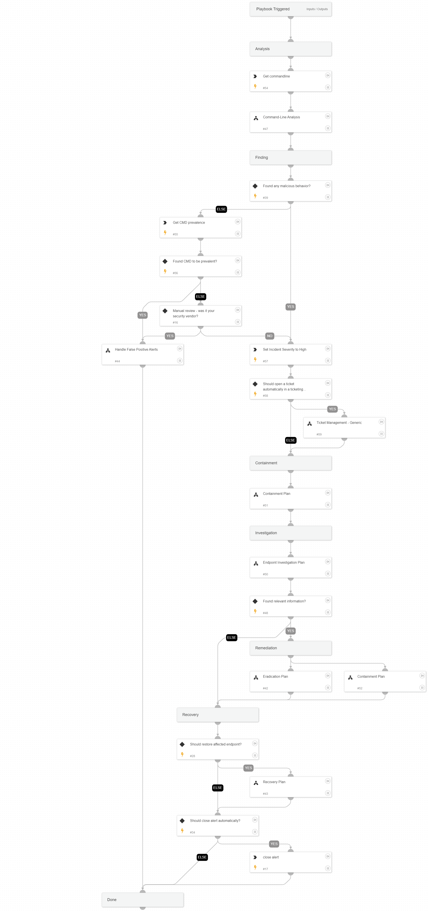

This playbook handles command and scripting interpreter alerts based on the MITRE T1059 technique.
An attacker might abuse command and script interpreters to execute commands, scripts, or binaries.
Most systems come with some kind of built-in command line interface and scripting capabilities. For example, macOS and Linux distributions include some form of Unix Shell while Windows installations include the Windows Command Shell and PowerShell.

**Attacker's Goals:**

An attacker can abuse these technologies in various ways as a means of executing arbitrary commands. Commands and scripts can be embedded in initial access payloads delivered to victims as lure documents or as secondary payloads downloaded from an existing C2. An attacker may also execute commands through interactive terminals/shells, as well as utilize various remote services to achieve remote execution.

**Analysis**

Due to the nature of this technique and the usage of built-in command line interfaces, the first step of the playbook is to analyze the command line. 
The command line analysis does the following:
- Checks and decodes base64
- Extracts and enriches indicators from the command line
- Checks specific arguments for malicious usage 

**Investigative Actions:**
The playbook checks for additional activity using the 'Endpoint Investigation Plan' playbook and utilizes the power of insight alerts.

**Response Actions**

After analyzing the data, the playbook's first response action is to contain the threat based on the initial data provided within the alert. In this phase, the playbook will:

* Isolate the endpoint based on playbook inputs.

When the playbook proceeds, it checks for additional activity using the 'Endpoint Investigation Plan' playbook. It then continues with the next stage, which includes, containment and eradication.

This phase executes the following containment actions:

* Automatically isolates the endpoint

It then continues with the following eradication actions:

* process termination

## Dependencies

This playbook uses the following sub-playbooks, integrations, and scripts.

### Sub-playbooks

* Command-Line Analysis
* Containment Plan
* Recovery Plan
* Handle False Positive Alerts
* Eradication Plan
* Ticket Management - Generic
* Endpoint Investigation Plan

### Integrations

* CortexCoreIR
* Cortex Core - IR

### Scripts

This playbook does not use any scripts.

### Commands

* core-get-cmd-analytics-prevalence
* closeInvestigation
* setParentIncidentFields
* core-get-dynamic-analysis

## Playbook Inputs

---

| **Name** | **Description** | **Default Value** | **Required** |
| --- | --- | --- | --- |
| ShouldCloseAutomatically | Whether to close the alert automatically or manually, after an analyst's review. | False | Optional |
| AutoRestoreEndpoint | Whether to execute the Recovery playbook. | False | Optional |
| AutoContainment | Whether to execute automatically or manually the containment plan tasks: \* Block indicators \* Quarantine file \* Disable user  |  | Optional |
| FileRemediation | Can be 'Quarantine' or 'Delete'. |  | Optional |
| ShouldOpenTicket | Whether to open a ticket automatically in a ticketing system. \(True/False\). | False | Optional |
| serviceNowShortDescription | A short description of the ticket. | XSIAM Incident ID - ${parentIncidentFields.incident_id} | Optional |
| serviceNowImpact | The impact for the new ticket. Leave empty for ServiceNow default impact. |  | Optional |
| serviceNowUrgency | The urgency of the new ticket. Leave empty for ServiceNow default urgency. |  | Optional |
| serviceNowSeverity | The severity of the new ticket. Leave empty for ServiceNow default severity. |  | Optional |
| serviceNowTicketType | The ServiceNow ticket type. Options are "incident", "problem", "change_request", "sc_request", "sc_task", or "sc_req_item". Default is "incident". |  | Optional |
| serviceNowCategory | The category of the ServiceNow ticket. |  | Optional |
| serviceNowAssignmentGroup | The group to which to assign the new ticket. |  | Optional |
| ZendeskPriority | The urgency with which the ticket should be addressed. Allowed values are "urgent", "high", "normal", or "low". |  | Optional |
| ZendeskRequester | The user who requested this ticket. |  | Optional |
| ZendeskStatus | The state of the ticket. Allowed values are "new", "open", "pending", "hold", "solved", or "closed". |  | Optional |
| ZendeskSubject | The value of the subject field for this ticket. | XSIAM Incident ID - ${parentIncidentFields.incident_id} | Optional |
| ZendeskTags | The array of tags applied to this ticket. |  | Optional |
| ZendeskType | The type of this ticket. Allowed values are "problem", "incident", "question", or "task". |  | Optional |
| ZendeskAssigne | The agent currently assigned to the ticket. |  | Optional |
| ZendeskCollaborators | The users currently CC'ed on the ticket. |  | Optional |
| description | The ticket description. | ${parentIncidentFields.description}. ${parentIncidentFields.xdr_url} | Optional |
| addCommentPerEndpoint | Whether to append a new comment to the ticket for each endpoint in the incident. Possible values: True/False. | True | Optional |
| CommentToAdd | Comment for the ticket. | ${alert.name}. Alert ID: ${alert.id} | Optional |

## Playbook Outputs

---
There are no outputs for this playbook.

## Playbook Image

---

