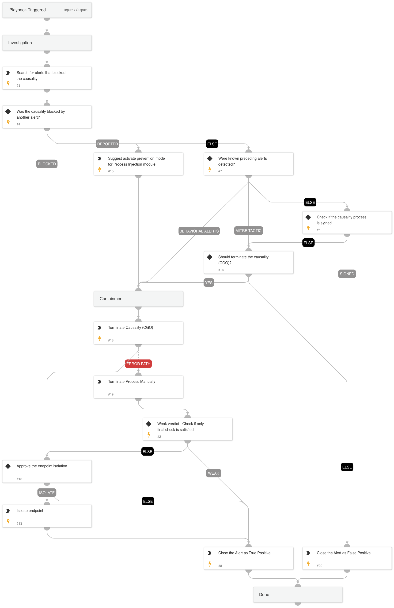

This playbook addresses the following alerts:

- Unsigned and unpopular process performed injection into a commonly abused process
- Unsigned and unpopular process performed process hollowing injection
- Unsigned and unpopular process performed queue APC injection
- Unsigned and unpopular process performed injection into a sensitive process
- Unsigned and unpopular process performed injection into svchost.exe

Playbook Stages:

Triage:

- Retrieve all alerts associated with the case for initial analysis.

Early Containment:

- Identify whether an agent prevention rule was triggered for the same process ID. If so, there is high confidence that the alert is malicious.
  - **If triggered in prevent mode**: This indicates a high-confidence verdict and the playbook proceeds with endpoint isolation.
  - **If triggered in report mode**: This also indicates a high-confidence verdict. The playbook will notify the customer, advise an update to **prevent mode** for better protection in the future, and proceed with the investigation.
  - **If no rule is triggered**: The playbook will continue with additional checks to ensure thorough assessment.

Investigation:

- Check for commonly triggered alerts that often precede process injection:
  - If found, initiate containment.
  - If not found, proceed with additional checks.
- Analyze if any alerts align with MITRE ATT&CK tactics **TA0004 (Privilege Escalation)** and **TA0005 (Defense Evasion)**:
  - If matching tactics are found, initiate containment.
  - If not, proceed with further investigation.
- Determine if the causality (parent) process is signed:
  - If signed by a trusted authority, close the alert.
  - If unsigned, escalate for manual approval for containment.

Containment:

- For alerts validated as threats, execute the following actions:
  - Terminate the causality process (CGO) if deemed malicious.
  - Isolate the endpoint in high-risk scenarios to prevent further compromise.

Requirements:

For response actions, you need the following integrations:

- Cortex Core - Investigation and Response.

## Dependencies

This playbook uses the following sub-playbooks, integrations, and scripts.

### Sub-playbooks

This playbook does not use any sub-playbooks.

### Integrations

* CortexCoreIR

### Scripts

* Print
* SearchIncidentsV2

### Commands

* closeInvestigation
* core-isolate-endpoint
* core-terminate-causality

## Playbook Inputs

---
There are no inputs for this playbook.

## Playbook Outputs

---
There are no outputs for this playbook.

## Playbook Image

---

