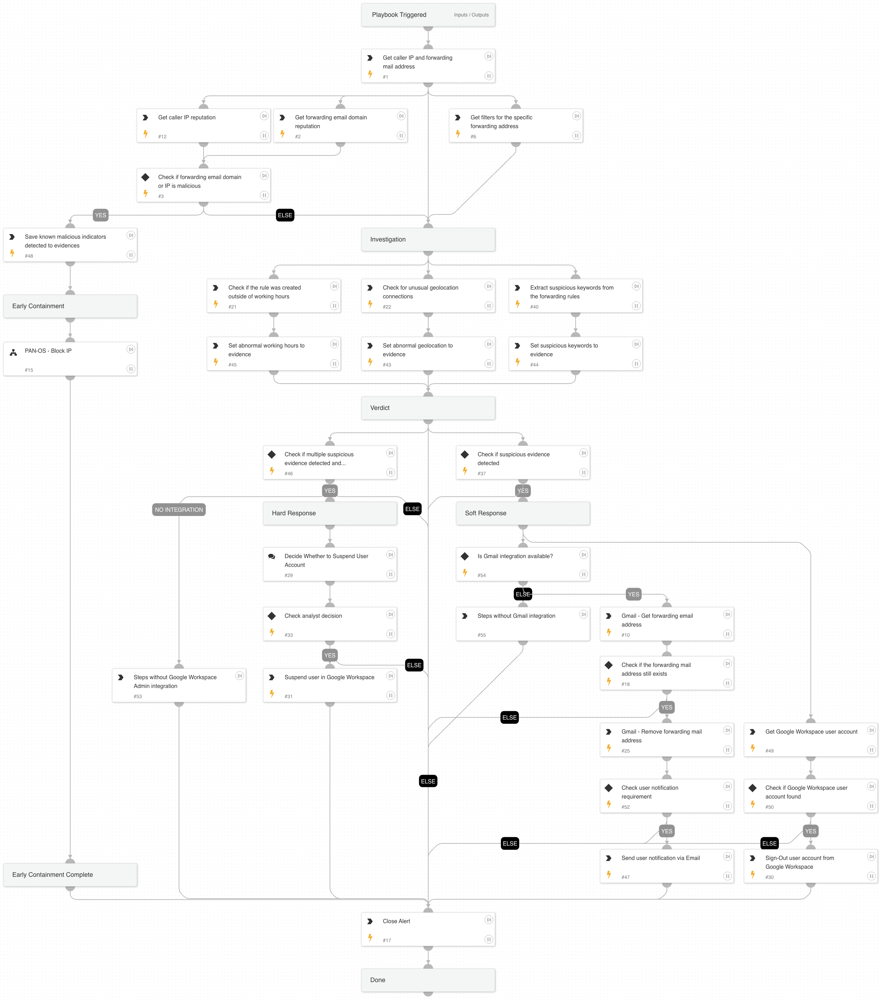

This playbook addresses the following alerts:

- A mail forwarding rule was configured in Google Workspace.
- A mail forwarding rule was configured in Google Workspace to an uncommon domain.

Playbook Stages:
 
Triage: 

- The playbook retrieves the caller's IP, the forwarding email address, and associated filters.

Early Containment:

- The playbook checks if the IP or domain of the forwarding email address is malicious. If so, it suggests blocking the IP using PAN-OS while continuing the investigation in parallel.

Investigation:

- The playbook verifies if the rule was created outside of working hours or from an unusual geolocation and extracts suspicious keywords from the forwarding rules. It then aggregates all evidence collected during the investigation.

Containment:

- If only one suspicious evidence is found, the playbook executes soft response actions, including signing the user out and deleting the forwarding email address from the user account mailbox. The user will be notified of these actions via email.
- If multiple suspicious evidences are found, the playbook executes both soft and hard response actions, recommending the analyst suspend the user account.

Requirements: 

For any response action, you need one of the following integrations:
- Gmail integration to fetch filters and remove the forwarding email address.
- Google Workspace Admin access to sign out and suspend the user account.

## Dependencies

This playbook uses the following sub-playbooks, integrations, and scripts.

### Sub-playbooks

* PAN-OS - Block IP

### Integrations

* Cortex Core - IR

### Scripts

* AnyMatch
* BetweenHours
* SetAndHandleEmpty

### Commands

* closeInvestigation
* core-get-cloud-original-alerts
* domain
* gmail-forwarding-address-get
* gmail-forwarding-address-remove
* gmail-list-filters
* gsuite-user-get
* gsuite-user-signout
* gsuite-user-update
* send-mail

## Playbook Inputs

---

| **Name** | **Description** | **Default Value** | **Required** |
| --- | --- | --- | --- |
| SendNotification | If set to "true," the playbook will send an email notification to the user informing them that the forwarding address was deleted. If "false," no notification will be sent. | true | Optional |

## Playbook Outputs

---
There are no outputs for this playbook.

## Playbook Image

---

