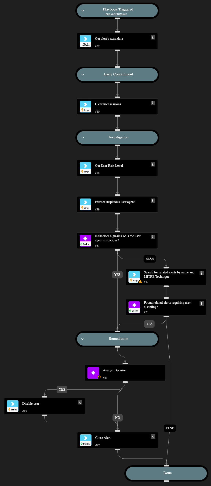

This playbook is designed to handle the following alerts:
- A successful SSO sign-in from TOR
- A successful SSO sign-in from TOR via a mobile device

The playbook executes the following stages:

Early Containment:
- The playbooks will perform early containment actions by clearing\revoking user sessions and enforcing re-authentication to terminate the connection from the Tor exit node and verify the user's identity. 
Depending on the alert source, the playbook will use either
Azure Active Directory Users or Okta v2 integrations to clear the user sessions.

Investigation:
During the alert investigation, the playbook will perform the following:
- Checks the user's risk score.
- Search for suspicious user agent usage within the alert.
- Search for related XDR alerts using the following MITRE techniques to identify any malicious activity:
T1566 - Phishing 
T1621 - Multi-Factor Authentication Request Generation
 T1110 - Brute Force
 T1556 - Modify Authentication Process

Remediation:
- Remediation actions will be taken if the user’s risk score is high, a suspicious user agent is detected, or a related alert is found. In such cases, the playbook will disable the account.
By default, account disabling requires analyst approval.

Requires: 
For any response action, you will need one of the following integrations: Azure Active Directory Users / Okta v2.

## Dependencies

This playbook uses the following sub-playbooks, integrations, and scripts.

### Sub-playbooks

* Block Account - Generic v2
* Containment Plan - Clear User Sessions

### Integrations

* Cortex Core - IR

### Scripts

* MatchRegexV2
* SearchIncidentsV2

### Commands

* closeInvestigation
* core-get-cloud-original-alerts
* core-list-risky-users

## Playbook Inputs

---
There are no inputs for this playbook.

## Playbook Outputs

---
There are no outputs for this playbook.

## Playbook Image

---

