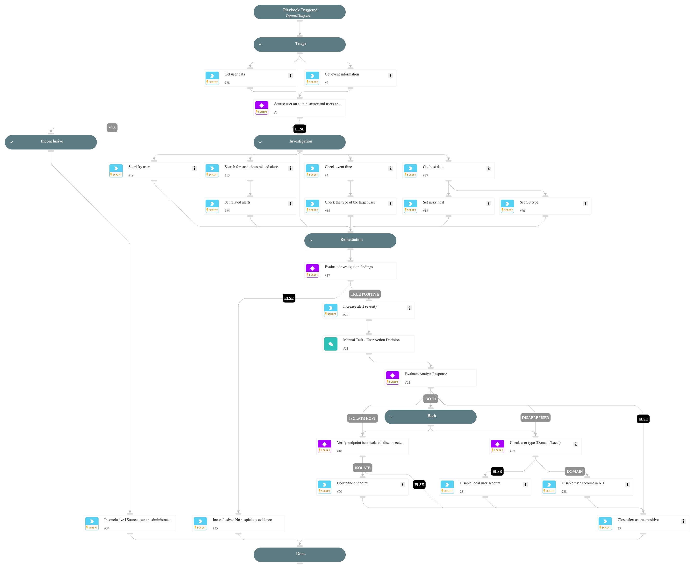

This playbook addresses the following alerts:

- A user deleted multiple users for the first time

Playbook Stages:

Triage:

- Collect initial alert data regarding the event.
- Check the user type of the source user.
- Host enrichment.

Investigation:

- Check if an admin user initiated the operation and whether the deleted users are disabled.
- Correlate recent user activity with related security alerts.
- Assess user's and host's risk level in Cortex XDR.
- Check the type of the user target.

Remediation:

- Evaluate investigation findings, if TP, the playbook will display the findings to an analyst for review and suggest user/host account disablement.

Requirements:

For response actions, you need the following integrations:

- Cortex Core - Investigation and Response
- Active Directory Query v2.

## Dependencies

This playbook uses the following sub-playbooks, integrations, and scripts.

### Sub-playbooks

This playbook does not use any sub-playbooks.

### Integrations

This playbook does not use any integrations.

### Scripts

* BetweenHours
* IncreaseAlertSeverity
* SearchAlertsV2
* SetAndHandleEmpty
* disable-user
* get-endpoint-data
* get-user-data
* isolate-endpoint

### Commands

* closeInvestigation
* core-execute-command
* core-get-cloud-original-alerts

## Playbook Inputs

---
There are no inputs for this playbook.

## Playbook Outputs

---
There are no outputs for this playbook.

## Playbook Image

---

