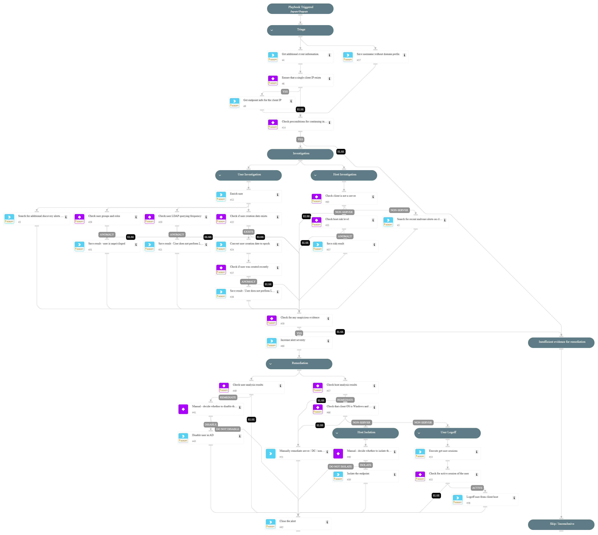

This playbook addresses the following alerts:

- A user executed suspicious LDAP enumeration queries

Playbook Stages:

Triage:

- Get additional event information about the LDAP searches executed by the user
- Ensure that a single client IP exists in the alert
- Get endpoint information for the client IP
- Check preconditions for continuing investigation based on the number of suspicious attributes, attack tool queries, and vulnerable certificate templates

Investigation:

- Enrich the user that executed the queries
- Check if the user was created recently
- Search for additional discovery alerts in the incident
- Check user groups and roles to determine if the user is unprivileged
- Check user querying frequency to detect anomalies
- Get host risk level
- Search for recent malware alerts on client IP

Remediation:

- With analyst approval, disable the user in Active Directory if user-related anomalies are found and the alert is a True Positive.
- With analyst approval, isolate the endpoint if host-related anomalies are found and the alert is a True Positive.
- Logoff user from client host if an active session is detected and the alert is a True Positive.

Requirements:

For any response action, you need the following integrations:

- Core - IR
- Active Directory Query v2.

## Dependencies

This playbook uses the following sub-playbooks, integrations, and scripts.

### Sub-playbooks

This playbook does not use any sub-playbooks.

### Integrations

This playbook does not use any integrations.

### Scripts

* SearchAlertsV2
* SetAndHandleEmpty
* get-user-data

### Commands

* ad-disable-account
* closeInvestigation
* core-get-cloud-original-alerts
* core-get-endpoints
* core-get-script-execution-results
* core-isolate-endpoint
* core-list-risky-hosts
* core-run-script-execute-commands

## Playbook Inputs

---
There are no inputs for this playbook.

## Playbook Outputs

---
There are no outputs for this playbook.

## Playbook Image

---

