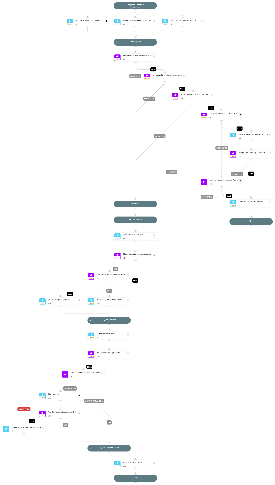

This playbook handles "AppleScript Process Executed With Rare Command Line" alerts.

Playbook Stages:

Investigation:
During the alert investigation, the playbook will perform the following:

- Searches for XSIAM prevention alerts with the same causality process ID.
- Checks if the causality|actor image has bad reputation or is not signed.
- Checks if malicious|suspicious patterns found in the command line.
- Searches for XSIAM insights alerts indicating a suspicious activity.

Remediation:

- Automatically terminate the causality process.
- Quarantine the causality|actor image (requires analyst approval).
- Automatically Close the alert.

## Dependencies

This playbook uses the following sub-playbooks, integrations, and scripts.

### Sub-playbooks

This playbook does not use any sub-playbooks.

### Integrations

This playbook does not use any integrations.

### Scripts

* SearchIncidentsV2
* SetMultipleValues

### Commands

* closeInvestigation
* core-get-hash-analytics-prevalence
* core-get-quarantine-status
* core-quarantine-files
* core-terminate-causality
* file

## Playbook Inputs

---
There are no inputs for this playbook.

## Playbook Outputs

---
There are no outputs for this playbook.

## Playbook Image

---

