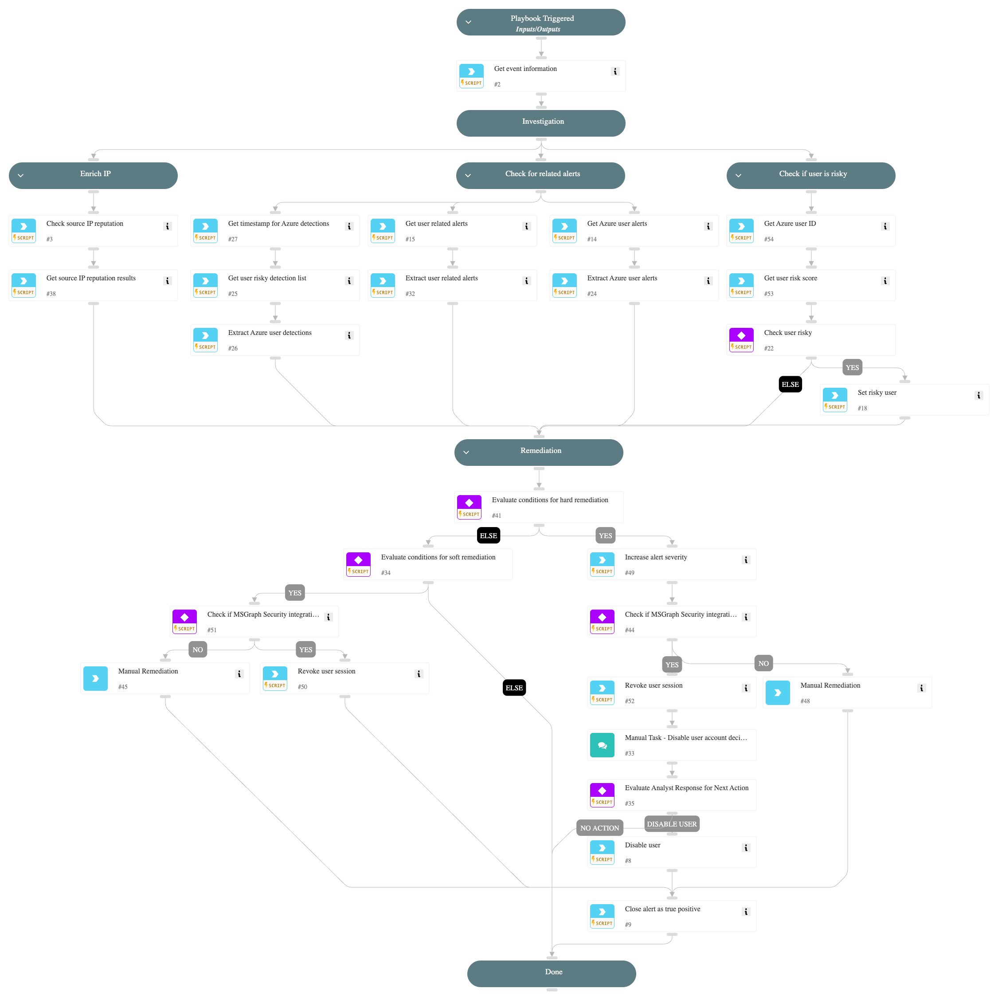

**This playbook addresses the following alert**:
- Suspicious authentication method addition to Azure account

**Playbook Stages**:

**Triage**:
- Gather initial information about the user.

**Investigation**:
- **Check IP Reputation**:
  - Analyze the reputation of the IP address related to the alert.
- **Check for Azure Alerts**:
  - Extract recent Azure security alerts for the user.
- **Check if User is Risky**:
  - Assess the risk score of the user based on Core and Azure risk indicators.
  - Investigate reasons behind any identified risks, including recent detections.

**Containment**:
- The playbook checks If hard remediation is needed, if yes, it will check if the integration "Microsoft Graph User" is enabled, the playbook will revoke the sessions of the user and provide a manual task for an analyst to review the findings and decide the next steps.
- Possible actions:
  - Disable the user.
  - Take no action.

If the integration is not enabled, the playbook will recommend performing the same action but manually.
- The playbook will check if soft remediation is needed, If yes, continue to revoke user's active sessions to ensure immediate containment.

**Requirements**:
For the best results, it's recommended to ensure these integrations are configured and working:
- `Cortex Core - Investigation and Response` for Core user risk evaluation.
- `Azure Risky Users` for retrieving user risk scores.
- `Microsoft 365 Defender` for advanced hunting queries and Azure security alerts.
- `Microsoft Graph User` is used to disable user and revoke session.

## Dependencies

This playbook uses the following sub-playbooks, integrations, and scripts.

### Sub-playbooks

This playbook does not use any sub-playbooks.

### Integrations

This playbook does not use any integrations.

### Scripts

* GetTime
* IncreaseAlertSeverity
* IsIntegrationAvailable
* SearchAlertsV2
* SetAndHandleEmpty
* clear-user-session
* disable-user
* get-user-data
* ip-enrichment

### Commands

* azure-risky-users-risk-detections-list
* closeInvestigation
* core-get-cloud-original-alerts
* microsoft-365-defender-advanced-hunting
* msgraph-user-get

## Playbook Inputs

---
There are no inputs for this playbook.

## Playbook Outputs

---
There are no outputs for this playbook.

## Playbook Image

---

