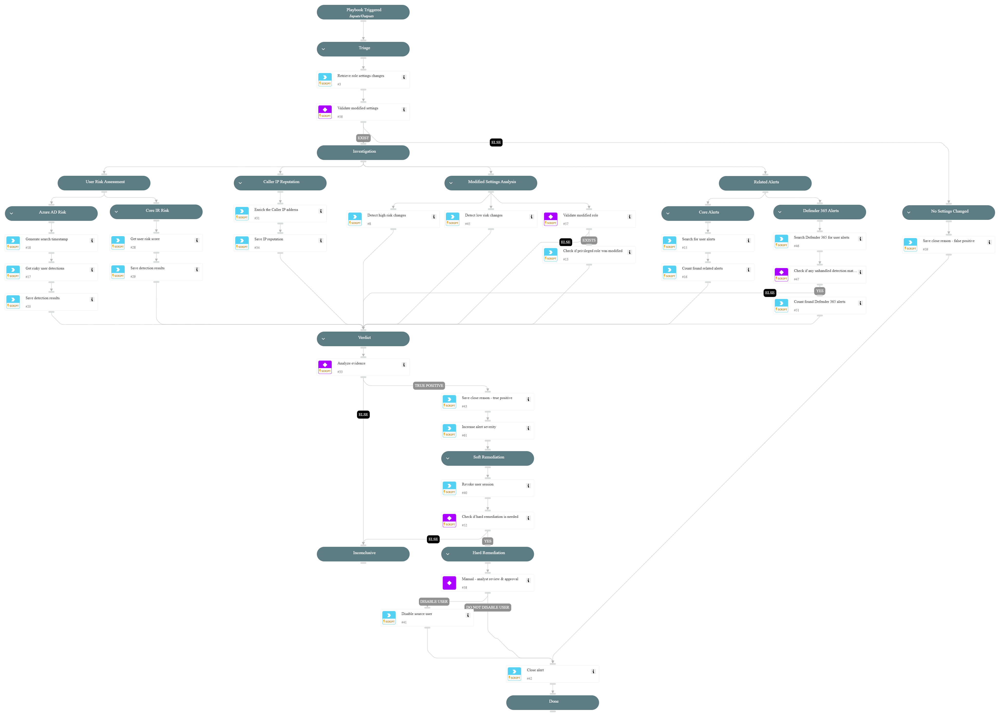

This playbook addresses the following alerts:

- Azure AD PIM role settings change

Playbook Stages:

Triage:

- Collect initial alert data regarding the Azure AD role settings modification.

Investigation:

- Analyze the impact of the role settings changes, categorizing them as high or moderate risk.
- Determine if the changes affect privileged roles in Azure AD.
- Correlate recent user activity with related security alerts.
- Assess the user's risk status in Azure AD and Cortex XDR.
- Evaluate the reputation of the IP address used for the changes.

Containment:

- Automatically revoke the user's active sessions across all applications.
- Present findings to an analyst for review and potential user account disablement.

Requirements:

For response actions, you need the following integrations:

- Cortex Core - Investigation and Response
- Microsoft Graph User.

## Dependencies

This playbook uses the following sub-playbooks, integrations, and scripts.

### Sub-playbooks

This playbook does not use any sub-playbooks.

### Integrations

This playbook does not use any integrations.

### Scripts

* GetTime
* IncreaseAlertSeverity
* SearchAlertsV2
* SetAndHandleEmpty
* clear-user-session
* disable-user
* get-user-data
* ip-enrichment

### Commands

* azure-risky-users-risk-detections-list
* closeInvestigation
* core-get-cloud-original-alerts
* microsoft-365-defender-advanced-hunting

## Playbook Inputs

---
There are no inputs for this playbook.

## Playbook Outputs

---
There are no outputs for this playbook.

## Playbook Image

---

