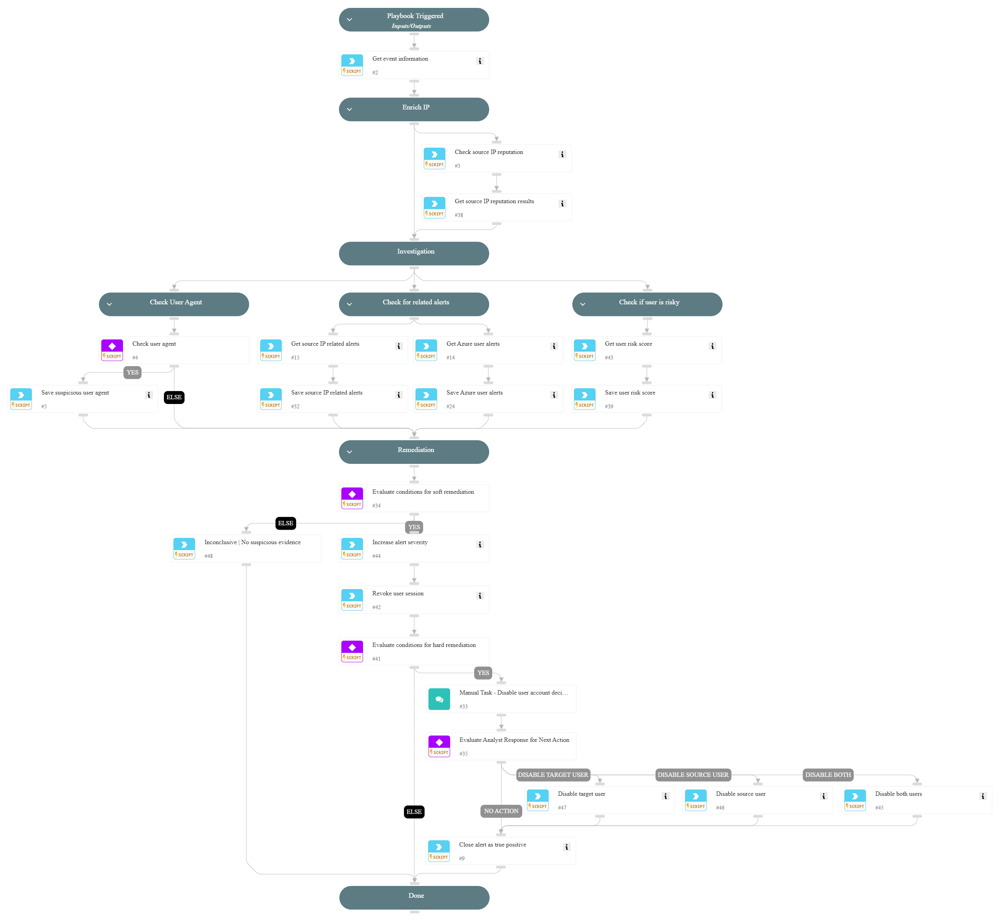

**This playbook addresses the following alert**:
- Azure AD account unlock/successful password reset

**Playbook Stages**:

**Triage**:
- Gather initial information about the user.

**Investigation**:
- **Check IP Reputation**:
  - Analyze the reputation of the IP address related to the alert.
- **Check for Azure Alerts**:
  - Extract recent Azure security alerts for the user.
- **Check if User is Risky**:
  - Assess the risk score of the user based on Core and Azure risk indicators.
  - Investigate reasons behind any identified risks, including recent detections.

**Containment**:
- Check if feature sum is greater than 2 (Possible features:new user agent/new asn/new country). If yes, continue to revoke user's active sessions to ensure immediate containment.
If no, continue to check investigation findings.
- Provide a manual task for an analyst to review the findings and decide the next steps.
- Possible actions:
  - Disable the target user.
  - Disable the resource user.
  - Disable both users.
  - Take no action.

**Requirements**:
For the best results, it's recommended to ensure these integrations are configured and working:
- `Cortex Core - Investigation and Response` for Core user risk evaluation.
- `Azure Risky Users` for retrieving user risk scores.
- `Microsoft 365 Defender` for advanced hunting queries and Azure security alerts.
- `Microsoft Graph User` for disabling accounts and revoking sessions.

## Dependencies

This playbook uses the following sub-playbooks, integrations, and scripts.

### Sub-playbooks

This playbook does not use any sub-playbooks.

### Integrations

* Cortex Core - Investigation and Response
* Azure Risky Users
* Microsoft 365 Defender
* Microsoft Graph User

### Scripts

* GetTime
* MatchRegexV2
* SearchAlertsV2
* SetAndHandleEmpty

### Commands

* azure-risky-users-list
* azure-risky-users-risk-detections-list
* closeInvestigation
* core-get-cloud-original-alerts
* core-list-risky-users
* ip
* microsoft-365-defender-advanced-hunting
* msgraph-user-account-disable
* msgraph-user-session-revoke

## Playbook Inputs

---
There are no inputs for this playbook.

## Playbook Outputs

---
There are no outputs for this playbook.

## Playbook Image

---

