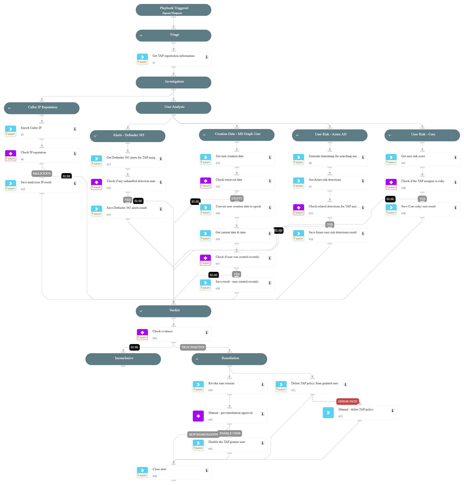

This playbook addresses the following alerts:

- Abnormal Azure Temporary Access Pass (TAP) account registration

Playbook Stages:

Triage:

- Retrieve additional data about the TAP registration including start/end times, usage type, and user details

Investigation:

- Analyze the reputation of the caller IP address
- Examine alerts from Microsoft Defender 365 related to the TAP assigner
- Check Azure AD risky user status and risk detections
- Review Cortex Core risk level for the user
- Verify creation date of the user account in Azure AD to identify recently created accounts
- Correlate evidence across multiple sources to determine potential compromise

Containment:

- For alerts determined to be true positives, automatically revoke the user's session in Microsoft applications
- Upon analyst approval, disable the user account that granted the TAP

Requirements: For response actions, you need the following integrations:

- Microsoft Graph User.

## Dependencies

This playbook uses the following sub-playbooks, integrations, and scripts.

### Sub-playbooks

This playbook does not use any sub-playbooks.

### Integrations

This playbook does not use any integrations.

### Scripts

* GetTime
* Set
* SetAndHandleEmpty
* clear-user-session
* disable-user
* get-user-data
* ip-enrichment

### Commands

* azure-risky-users-risk-detections-list
* closeInvestigation
* core-get-cloud-original-alerts
* microsoft-365-defender-advanced-hunting
* msgraph-user-get
* msgraph-user-tap-policy-delete

## Playbook Inputs

---
There are no inputs for this playbook.

## Playbook Outputs

---
There are no outputs for this playbook.

## Playbook Image

---

