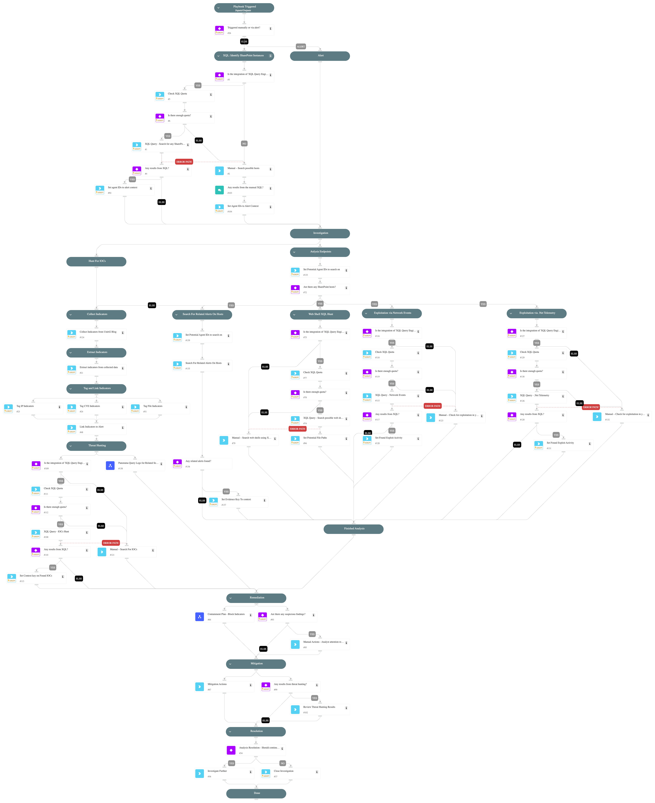

## CVE-2025-49706 and CVE-2025-49704 and CVE-2025-53770 and CVE-2025-53771 — Microsoft SharePoint Identity Spoofing & RCE Chain - ToolShell

---

CVE-2025-49706 and CVE-2025-49704 are a critical vulnerability chain affecting Microsoft SharePoint Server 2016, 2019, and Subscription Editions. The attack leverages a broken authentication mechanism, allowing low-privileged users to impersonate administrators. Once elevated, attackers can upload malicious `.aspx` webshells via SharePoint features, enabling full remote code execution (RCE) on the underlying server.

CVE-2025-53770 (a variant of CVE-2025-49706) and CVE-2025-53771 are recently disclosed vulnerabilities that expand the attack surface by abusing improperly secured diagnostic and auxiliary features. Attackers with access to a compromised or misconfigured SharePoint environment can exploit these endpoints to leak internal configuration, gather debugging data, and possibly chain these flaws for further code execution or lateral movement. These CVEs are often used in post-exploitation or reconnaissance stages.

---

### Vulnerability Overview

* **Platform Affected**: Microsoft SharePoint Server 2016 / 2019 / Subscription Edition
* **CVE IDs**:
  * CVE-2025-49706 – Authentication Spoofing Vulnerability
  * CVE-2025-49704 – Remote Code Execution via Webshell Upload
  * CVE-2025-53770 – Diagnostic Endpoint Abuse & Information Disclosure
  * CVE-2025-53771 – Debug Handler Exposure & Access Control Misconfiguration

* **CVSS Scores**: 7.1, 8.8, 9.8 ,7.1
* **Exploitability**: Requires valid low-privileged SharePoint access or access to exposed debug/diagnostic endpoints
* **Impact**: Allows attackers to impersonate admin users, execute arbitrary code, and extract sensitive internal data
* **Exploitation Chain**: Identity spoofing → elevated privileges → webshell upload → diagnostic/debug abuse → full RCE + data exposure

These flaws enable an attacker to:
- Spoof authentication
- Bypass security boundaries
- Gain remote execution
- Extract internal diagnostic/debug data

---

### Exploitation Flow

1. Initial foothold via low-privileged credentials
2. Abuse CVE-2025-49706 to impersonate a Site Collection Admin
3. Use elevated rights to upload `.aspx` webshells or payloads
4. Trigger the malicious file via HTTP request, exploiting CVE-2025-49704
5. Optionally exploit CVE-2025-53770 and CVE-2025-53771 to leak config/debug data or expand control
6. Execute system-level commands or scripts via `w3wp.exe` (IIS)

---

### Mitigation & Recommendations

* Apply Patches Immediately:
  * [CVE-2025-49706](https://msrc.microsoft.com/update-guide/vulnerability/CVE-2025-49706)
  * [CVE-2025-49704](https://msrc.microsoft.com/update-guide/vulnerability/CVE-2025-49704)
  * [CVE-2025-53770](https://msrc.microsoft.com/update-guide/vulnerability/CVE-2025-53770)
  * [CVE-2025-53771](https://msrc.microsoft.com/update-guide/vulnerability/CVE-2025-53771)

* Harden SharePoint diagnostic/debug endpoints
* Rotate SharePoint Server ASP.NET machine keys
* Check IIS logs for suspicious activity
* Disable/Isolate unnecessary SharePoint services or endpoints (at least until those servers are patched)

---

### References

* [CVE-2025-49706 - NVD](https://nvd.nist.gov/vuln/detail/CVE-2025-49706)
* [CVE-2025-49704 - NVD](https://nvd.nist.gov/vuln/detail/CVE-2025-49704)
* [CVE-2025-53770 - NVD](https://nvd.nist.gov/vuln/detail/CVE-2025-53770)
* [CVE-2025-53771 - NVD](https://nvd.nist.gov/vuln/detail/CVE-2025-53771)
* [Microsoft Security Update – July 2025](https://msrc.microsoft.com/update-guide/)

---

### How to trigger the playbook

Triggered via:
- Cortex XDR alerts: `"CVE Exploitation - 685768089"` or `"CVE Exploitation - 818854253"` or `"CVE Exploitation - 903162508"`
- Manually created an incident with this playbook.

---

### Playbook Flow

1. Run XQL Queries to detect possible affected servers running Microsoft SharePoint.
2. Search for downloaded or created webshell files using XQL + PowerShell (also for the known file name artifacts).
3. Run XQL on ane network and XDR dotnet events to determine if there was any usage of the CVEs in the organization.
4. Check for malicious activity on the possible affected hosts for post-exploitation activities ( e.g., running PowerShell encoded commands on the hosts).
5. Retrieve  IOCs from the Unit42 blog, hunt for those IOCs with XQL, and block malicious indicators.

---

**Note:** 
This is a beta playbook, which lets you implement and test pre-release software. Since the playbook is beta, it might contain bugs. Updates to the pack during the beta phase might include non-backward-compatible features. We appreciate your feedback on the quality and usability of the pack to help us identify issues, fix them, and continually improve.

## Dependencies

This playbook uses the following sub-playbooks, integrations, and scripts.

### Sub-playbooks

* Containment Plan - Block Indicators
* Panorama Query Logs for Related Session

### Integrations

This playbook does not use any integrations.

### Scripts

* IsIntegrationAvailable
* ParseHTMLIndicators
* SearchAlertsV2
* SetAndHandleEmpty

### Commands

* associateIndicatorsToAlert
* closeInvestigation
* createNewIndicator
* extractIndicators
* setAlert
* xdr-xql-generic-query
* xdr-xql-get-quota

## Playbook Inputs

---
There are no inputs for this playbook.

## Playbook Outputs

---
There are no outputs for this playbook.

## Playbook Image

---

