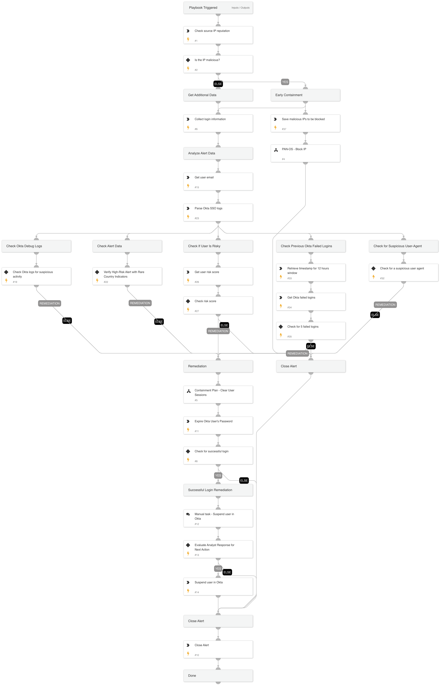

This playbook addresses the following alerts:

- User rejected numerous SSO MFA attempts
- Multiple SSO MFA attempts were rejected by a user with suspicious characteristics

Playbook Stages:

Triage:
- The playbook checks the IP address reputation associated with the MFA attempts and gathers related login events.

Early Containment:
- If the IP address is identified as malicious, the playbook blocks the IP. The investigation continues in parallel to this phase.

Investigation:
- The playbook performs an in-depth analysis, including:
  - Assessing the user's risk score to identify potentially compromised accounts.
  - Checking for an unusually high number of invalid credential attempts, which may indicate brute-force or credential-stuffing activity.
  - Verifying whether Okta logs indicate a malicious source IP based on Okta's threat intelligence.
  - Reviewing whether there have been an excessive number of MFA rejections from the user, suggesting potentially compromised behavior.
  - Looking for abnormal user agent patterns that may indicate suspicious or compromised access methods.
  - Investigating previous failed Okta login attempts within a specified timeframe to identify patterns.

Containment:
- If suspicious activity is confirmed, the playbook initiates the following containment actions:
  - Clears the user's active sessions and expires their password to prevent further unauthorized access.
  - If a successful login attempt was also detected, the playbook prompts a manual task for an analyst to review and decide on further action.

Requirements:
For any response actions, the following integrations is required:
- Okta v2

For early containment actions, the following integration is required:
- Palo Alto Networks PAN-OS.

## Dependencies

This playbook uses the following sub-playbooks, integrations, and scripts.

### Sub-playbooks

* Containment Plan - Clear User Sessions
* PAN-OS - Block IP

### Integrations

* CoreIOCs
* CortexCoreIR
* CortexCoreXQLQueryEngine

### Scripts

* GetTime
* SetAndHandleEmpty

### Commands

* closeInvestigation
* core-get-cloud-original-alerts
* core-list-risky-users
* ip
* okta-expire-password
* okta-get-failed-logins
* okta-suspend-user

## Playbook Inputs

---
There are no inputs for this playbook.

## Playbook Outputs

---
There are no outputs for this playbook.

## Playbook Image

---

