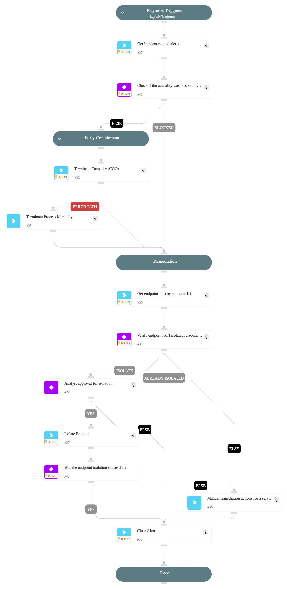

This playbook is designed to handle the following alerts:
- Command-line arguments match Mimikatz execution
- Mimikatz command-line arguments
- Credential dumping via wce.exe
- Credential dumping via gsecdump.exe
- PowerShell runs with known Mimikatz arguments
- Hash cracking using Hashcat tool
- Credential dumping via fgdump.exe
- Credential dumping via LaZagne
- Credential dumping via pwdumpx.exe
- Dumping lsass.exe memory for credential extraction
- Memory dumping with comsvcs.dll

The playbook executes the following stages:

Early Containment:
- Handles malicious alerts by terminating the causality process.

Remediation:
- Handles malicious alerts by suggesting the analyst to isolate the endpoint.

## Dependencies

This playbook uses the following sub-playbooks, integrations, and scripts.

### Sub-playbooks

This playbook does not use any sub-playbooks.

### Integrations

CortexCoreIR

### Scripts

SearchIncidentsV2

### Commands

* closeInvestigation
* core-isolate-endpoint
* core-get-endpoints
* core-terminate-causality

## Playbook Inputs

---
There are no inputs for this playbook.

## Playbook Outputs

---
There are no outputs for this playbook.

## Playbook Image

---

