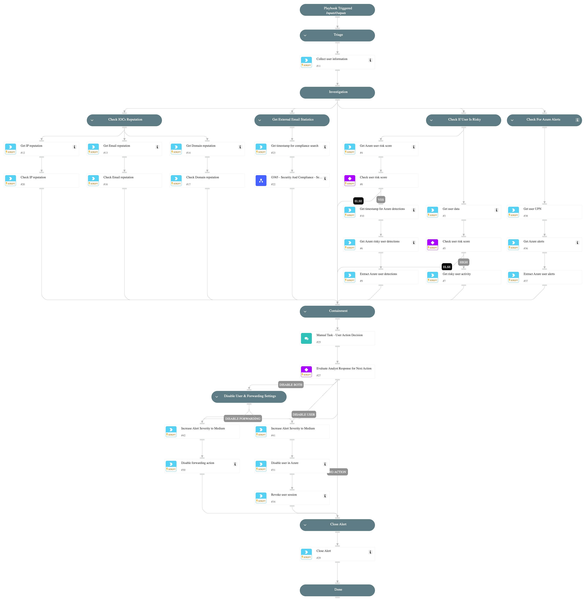

**This playbook addresses the following alerts**:
- Exchange user mailbox forwarding.
- Suspicious Exchange user mailbox forwarding.

**Playbook Stages**:

**Triage**:
- Collect initial information about the internal user and the associated external forwarding address.

**Investigation**:
- **Check IOCs Reputation**:
  - Analyze the reputation of IP addresses, email addresses, and domains associated with the alert.
- **Get External Email Statistics**:
  - Retrieve statistics of email interactions between the internal user and the external forwarding address over the last 2 days, including:
    - Number of emails sent to and received from the external address.
    - Number of users interacting with the external address.
- **Check if User is Risky**:
  - Assess the internal user's risk score using:
    - **Core Risk Evaluation**: Identify high-risk users and extract reasons behind elevated risk levels.
    - **Azure Risk Indicators**: Retrieve Azure risk scores, detections, and recent security alerts for the internal user.
- **Check for Azure Alerts**:
  - Perform an advanced hunting query in Microsoft 365 Defender to extract recent Azure alerts associated with the internal user.

**Containment**:
- Provide a manual task for an analyst to review the findings and determine the appropriate response.
- Possible actions:
  - Disable the user in Azure AD to prevent further unauthorized actions.
  - Disable mailbox forwarding for the user in Exchange Online.
  - Disable both user and forwarding.
  - Take no action.
- If the user is disabled, revoke active sessions to ensure immediate containment.

**Requirements**:
For the best results, it's recommended to ensure these integrations are configured and working:
- `Cortex Core - Investigation and Response` for Core user risk evaluation.
- `Azure Risky Users` for retrieving Azure-based user risk scores and detections.
- `Microsoft 365 Defender` for advanced hunting queries and extracting Azure alerts.
- `Microsoft Graph User` for disabling user accounts and revoking active sessions.
- `Exchange Online EWS` for disabling mailbox forwarding.
- `Security And Compliance V2` for fetching email interaction statistics.

## Dependencies

This playbook uses the following sub-playbooks, integrations, and scripts.

### Sub-playbooks

* O365 - Security And Compliance - Search

### Integrations

* Cortex Core - IR
* AzureRiskyUsers
* Microsoft 365 Defender
* Microsoft Graph User
* EWSO365
* SecurityAndComplianceV2

### Scripts

* GetTime
* SetAndHandleEmpty

### Commands

* azure-risky-users-list
* azure-risky-users-risk-detections-list
* closeInvestigation
* core-get-cloud-original-alerts
* core-list-risky-users
* domain
* email
* ews-mail-forwarding-disable
* ip
* microsoft-365-defender-advanced-hunting
* msgraph-user-account-disable
* msgraph-user-session-revoke

## Playbook Inputs

---
There are no inputs for this playbook.

## Playbook Outputs

---
There are no outputs for this playbook.

## Playbook Image

---

