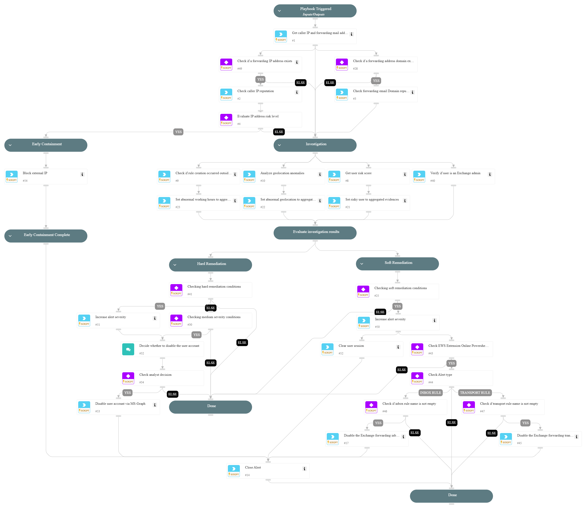

This playbook addresses the following alerts:

- External Exchange inbox forwarding rule configured.
- Suspicious Exchange inbox forwarding rule configured.
- Suspicious Exchange email-hiding inbox rule.
- Possible BEC Exchange email-hiding inbox rule.
- Exchange email-hiding transport rule based on message keywords.
- Suspicious Exchange email-hiding transport rule.
- Exchange transport forwarding rule configured.
- Suspicious Exchange transport forwarding rule configured.

Playbook Stages:
 
Triage: 

- The playbook retrieves the caller's IP, the forwarding email address, and the domain.

Early Containment:

- The playbook checks if the IP or domain of the forwarding email address is malicious. If so, it suggests blocking the IP using PAN-OS while continuing the investigation in parallel.

Investigation:

- The playbook checks for suspicious behaviors, including whether an Exchange admin created the rule outside of working hours, from unusual geolocation, or if the user who created the rule has a high-risk score. It then aggregates all evidence collected during the investigation.

Containment:

- Soft Response Actions: If at least two suspicious pieces of evidence are identified, the playbook will execute soft response actions. These actions include signing the user out and disabling the forwarding rule configured in the user's account mailbox.
- Hard Response Actions: If more than two suspicious pieces of evidence are identified, the playbook escalates to hard response actions. These actions include disabling the user account upon analyst decision and removing the forwarding rule from the user's account mailbox.

Requirements: 

For any response action, you need the following integrations:
- EWS Extension Online Powershell v3 integration.
- Azure Active Directory Users.

## Dependencies

This playbook uses the following sub-playbooks, integrations, and scripts.

### Sub-playbooks

* Containment Plan - Clear User Sessions
* PAN-OS - Block IP

### Integrations

* CoreIOCs
* CortexCoreIR
* CortexCoreXQLQueryEngine
* EWSO365

### Scripts

* AnyMatch
* BetweenHours
* SetAndHandleEmpty

### Commands

* closeInvestigation
* core-get-cloud-original-alerts
* core-list-risky-users
* domain
* ews-mail-flow-rule-disable
* ews-rule-disable
* ip
* msgraph-user-account-disable

## Playbook Inputs

---
There are no inputs for this playbook.

## Playbook Outputs

---
There are no outputs for this playbook.

## Playbook Image

---

