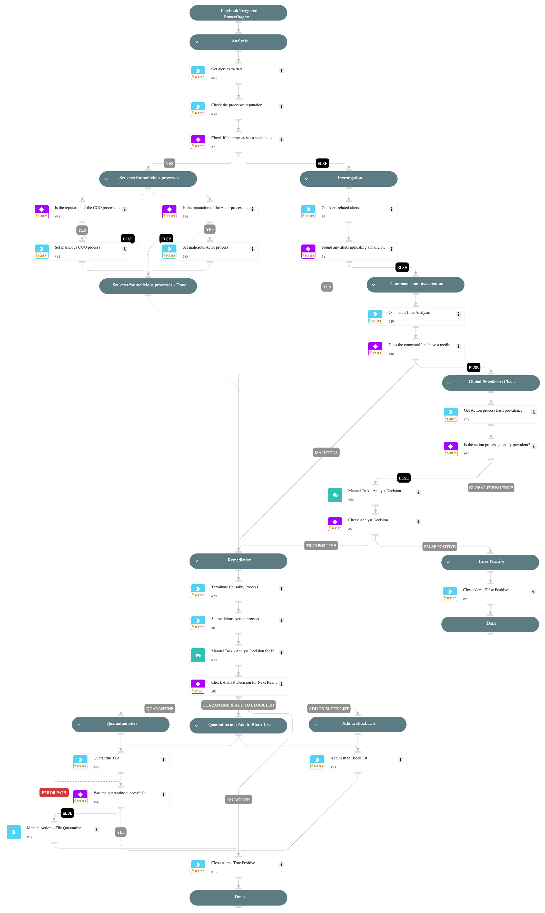

This playbook is designed to handle the following alerts:
- Execution of an uncommon process at an early startup stage with suspicious characteristics.
- Execution of an uncommon process with a local/domain user SID at an early startup stage with suspicious characteristics.

Playbook Stages:

Analysis:

- Checks the process's reputation.

Investigation:

- Searches for related Cortex XSIAM alerts to identify potential attack patterns with persistence mechanisms.
- Checks for any suspicious parameters in the command line (if the command line risk score is medium or higher).
- Checks the Action process prevalence.

Verdict:

If the playbook detects that the Action process is globally prevalent and the other conditions in the investigation stage do not match, it closes the alert as a False Positive.

If the playbook detects that any of the following conditions are met:
- The process reputation is malicious.
- Related alerts were found.
- The command line risk score is medium or higher.

The playbook proceeds with remediation actions. Otherwise, it presents the investigation data to the analyst for decision-making on the appropriate action.

Remediation:

- Terminate the malicious process.
- Quarantine the malicious process (Requires analyst approval)
- Add the malicious process hash to the block list (Requires analyst approval)
- Automatically close the alert.

## Dependencies

This playbook uses the following sub-playbooks, integrations, and scripts.

### Sub-playbooks

Quarantine File

### Integrations

This playbook does not use any integrations.

### Scripts

* CommandLineAnalysis
* SearchIncidentsV2
* SetMultipleValues

### Commands

* closeInvestigation
* core-blocklist-files
* core-get-cloud-original-alerts
* core-get-hash-analytics-prevalence
* core-terminate-causality
* file

## Playbook Inputs

---
There are no inputs for this playbook.

## Playbook Outputs

---
There are no outputs for this playbook.

## Playbook Image

---

