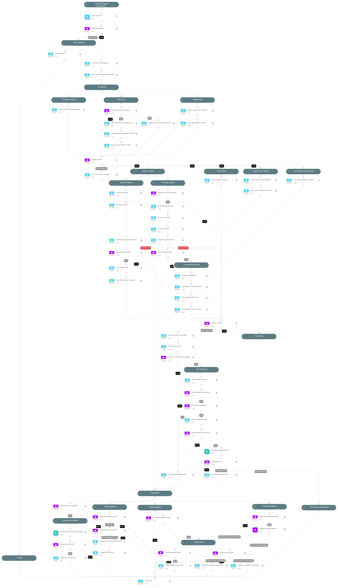

This playbook is designed to handle the following alerts:

- External Login Password Spray
- Successful External Login Password Spray
- External Login Password Spray on a Domain Controller
- External Login Password Spray Involving a Honey User
- Successful External Login Password Spray on a Domain Controller
- Successful External Login Password Spray on a sensitive server

The playbook is designed to investigate and respond to external login password sprays. It enriches the external IP to enable early containment, retrieves event information, and determines how the attack was carried out and whether it was successful.

Playbook Stages:

Early Containment:

- With analyst approval, the playbook will block the malicious external IP address involved in the password spray attack, limiting the attacker's ability to continue their actions.

Investigation:

- The playbook analyzes the timestamps of the login attempts to detect patterns, checks whether any logons were successful, and retrieves the Risk Score for users who successfully logged in as part of the attack.

Containment:

- Based on the user’s risk level, the playbook will expire the user’s password to prevent further unauthorized access and terminate any active RDP sessions for the affected user.

Requirements:

For response actions, the following integrations are required: 

- Active Directory (AD)
- PAN-OS
- Core - IR

## Dependencies

This playbook uses the following sub-playbooks, integrations, and scripts.

### Sub-playbooks

* PAN-OS - Block IP

### Integrations

* CortexCoreXQLQueryEngine
* CoreIOCs
* CortexCoreIR

### Scripts

* AnalyzeTimestampIntervals
* SetAndHandleEmpty

### Commands

* core-run-script-execute-commands
* core-get-cloud-original-alerts
* ip
* ad-expire-password
* closeInvestigation
* core-list-risky-users

## Playbook Inputs

---
There are no inputs for this playbook.

## Playbook Outputs

---
There are no outputs for this playbook.

## Playbook Image

---

