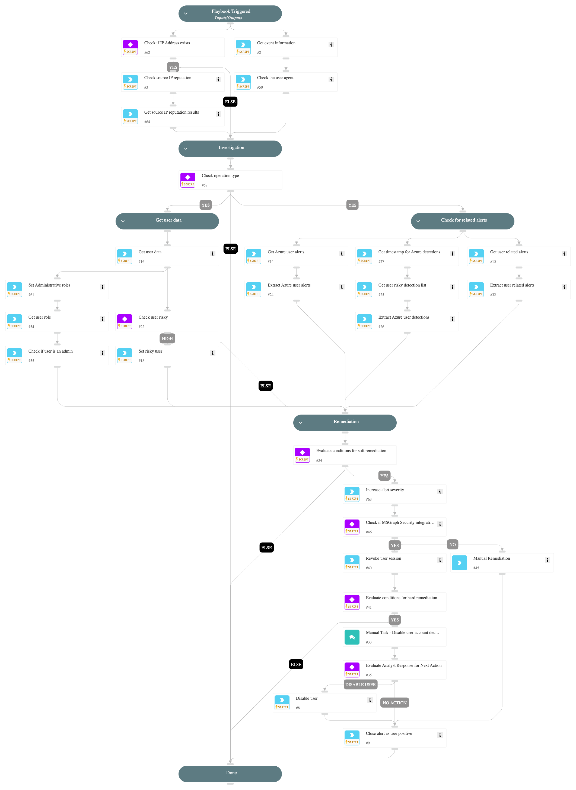

**This playbook addresses the following alert**:
- First Azure AD PowerShell operation for a user

**Playbook Stages**:

**Triage**:
- Gather initial information about the user.
- Check IP Reputation.
- Check the User Agent.

**Investigation**:
- **Check for Azure Alerts**:
  - Extract recent Azure security alerts for the user.
- **Check if User is Risky**:
  - Assess the user's risk score based on Core and Azure risk indicators.
  - Investigate reasons behind any identified risks, including recent detections.
- **Investigate user data**:
  - Check the user creation date to asses if the user is new.
  - Check the role of the user.

**Containment**:
- The playbook checks if soft remediation is needed, if yes, it will check if the integration "Microsoft Graph User" is enabled, the playbook will revoke the sessions of the user.
- The playbook checks if hard remediation is needed, if yes,
a manual task will be displayed for an analyst to review the findings and decide the next steps.
- Possible actions:
  - Disable the user.
  - Take no action.

**Requirements**:
For the best results, it's recommended to ensure these integrations are configured and working:
- `Cortex Core - Investigation and Response` for Core user risk evaluation.
- `Azure Risky Users` for retrieving user risk scores.
- `Microsoft 365 Defender` for advanced hunting queries and Azure security alerts.
- `Microsoft Graph User` is used to disable user and revoke session.

## Dependencies

This playbook uses the following sub-playbooks, integrations, and scripts.

### Sub-playbooks

This playbook does not use any sub-playbooks.

### Integrations

This playbook does not use any integrations.

### Scripts

* CreateArray
* GetTime
* IncreaseAlertSeverity
* IsIntegrationAvailable
* MatchRegexV2
* SearchAlertsV2
* SetAndHandleEmpty
* clear-user-session
* disable-user
* get-user-data
* ip-enrichment

### Commands

* azure-risky-users-risk-detections-list
* closeInvestigation
* core-get-cloud-original-alerts
* microsoft-365-defender-advanced-hunting
* msgraph-identity-directory-role-members-list

## Playbook Inputs

---
There are no inputs for this playbook.

## Playbook Outputs

---
There are no outputs for this playbook.

## Playbook Image

---

