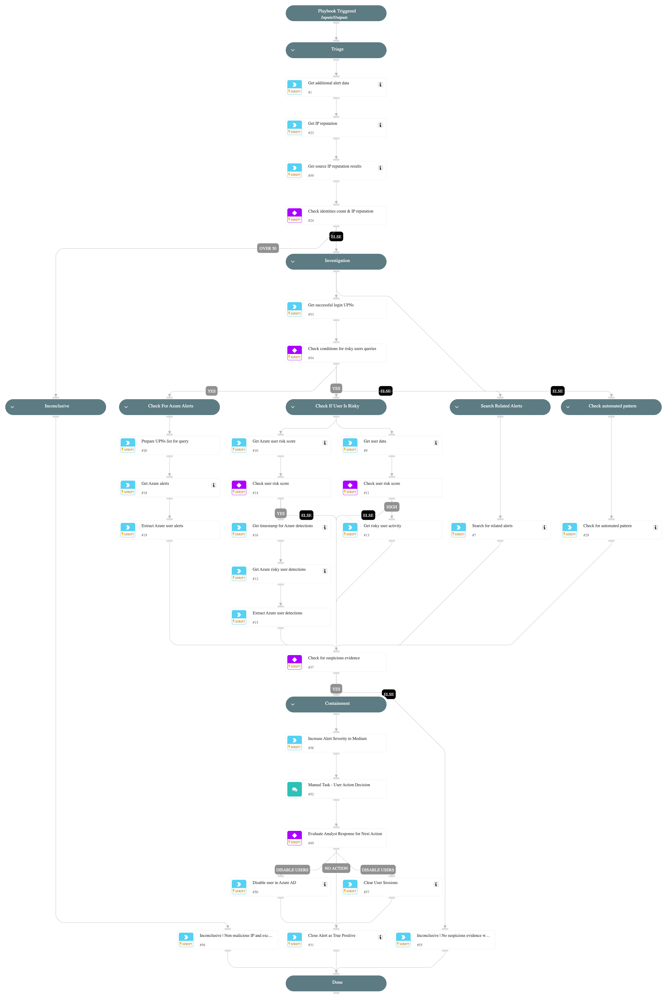

**This playbook addresses the following alert**:
- Intense SSO failures with suspicious characteristics.

**Playbook Stages**:

**Triage**:
- Collect additional alert data.
- Retrieve IP reputation.
- Analyze identity count and IP reputation:
  - If failures involve many users and the IP is not malicious, the alert is likely a false positive and will be closed automatically.

**Investigation**:
- Identify users with successful logins.
- Check risk indicators for affected users.
- Search for related alerts.
- Analyze authentication patterns for automation.
- Retrieve Azure and Core risk scores.
- Extract security alerts linked to affected users.
- **Check for Suspicious Evidence**, including:
  - Blocked sign-ins from a malicious IP.
  - Related security incidents and high-risk IP reputation.
  - Risk detections from Azure and Core.
  - Suspicious authentication targeting admin portals (e.g., Azure Portal, Exchange Admin, Microsoft 365 Admin).
  - The number of distinct identities involved.

**Containment**:
- **Automatic Actions**:
  - If strong indicators of compromise exist, clear active user sessions.
- **Analyst Review**:
  - Findings are presented for review.
  - **If user disablement is required**, the analyst can select users to disable in Azure AD.
  - If a user is disabled, the playbook will also **clear their active sessions**.

**Requirements**:
Ensure the following integrations are configured:
- **Microsoft Graph Identity** for Conditional Access and risk scores.
- **Microsoft Defender for Identity** for authentication analysis.
- **Core** for user risk evaluation and alert correlation.
- **Threat Intelligence Integrations** for IP reputation analysis.

## Dependencies

This playbook uses the following sub-playbooks, integrations, and scripts.

### Sub-playbooks

This playbook does not use any sub-playbooks.

### Integrations

This playbook does not use any integrations.

### Scripts

* AnalyzeTimestampIntervals
* GetTime
* IncreaseAlertSeverity
* SearchAlertsV2
* SetAndHandleEmpty
* clear-user-session
* disable-user
* get-user-data
* ip-enrichment

### Commands

* azure-risky-users-list
* azure-risky-users-risk-detections-list
* closeInvestigation
* core-get-cloud-original-alerts
* microsoft-365-defender-advanced-hunting

## Playbook Inputs

---
There are no inputs for this playbook.

## Playbook Outputs

---
There are no outputs for this playbook.

## Playbook Image

---

