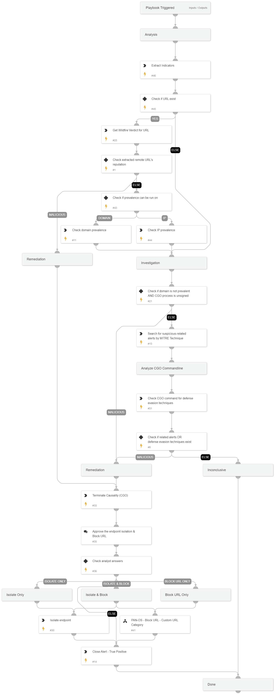

This playbook addresses the following alerts:
 
- Msiexec execution of an executable from an uncommon remote location with a specific port
- Msiexec execution of an executable from an uncommon remote location without properties
 
Playbook Stages:
  
Analysis: 
 
- Check extracted URL reputation:
  - Determine if the MSI package was installed from a malicious source
  - If the URL is found to be malicious, the playbook will proceed directly to remediation steps
 
Investigation:

- Check extracted domain's prevalence and causality process signature status:
  - Evaluate the prevalence of the domain from which the MSI package was downloaded
  - Verify if the causality process (CGO) is signed or unsigned
  - If the domain is found malicious and the causality process is unsigned, the playbook will proceed directly to remediation steps

- Check for the following related alerts: 
  - Local Analysis Malware
  - Mitre Techniques:
    - T1140 - Deobfuscate/Decode Files or Information
    - T1059 - Command and Scripting Interpreter 

- Analyze CGO command line for defense evasion techniques:
  - Evaluate the command line for suspicious patterns which indicates attempts to bypass security controls

- If the command line contains suspicious patterns or related alerts are found, the playbook will proceed directly to remediation steps

Containment:
 
- Terminate causality process
- Block maliciou URL (Manual approval)
  - Implement URL blocking using PAN-OS through Custom URL Categories
- Isolate endpoint (Manual approval)
 
Requirements: 
 
For any response action, you need the following integration:
 
- PAN-OS

## Dependencies

This playbook uses the following sub-playbooks, integrations, and scripts.

### Sub-playbooks

* PAN-OS - Block URL - Custom URL Category

### Integrations

* CortexCoreIR

### Scripts

* CommandLineAnalysis
* SearchIncidentsV2

### Commands

* closeInvestigation
* core-get-IP-analytics-prevalence
* core-get-domain-analytics-prevalence
* core-isolate-endpoint
* core-terminate-causality
* extractIndicators
* wildfire-get-verdict

## Playbook Inputs

---
There are no inputs for this playbook.

## Playbook Outputs

---
There are no outputs for this playbook.

## Playbook Image

---

