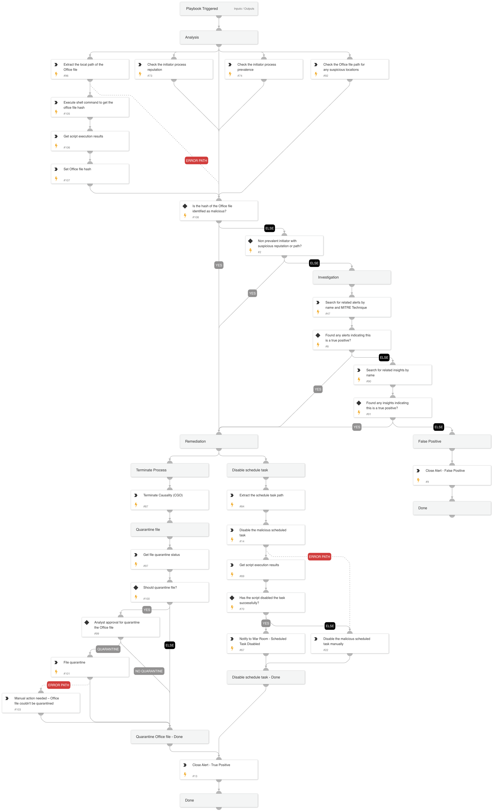

This playbook handles "Office process creates a scheduled task via file access" alerts.

Playbook Stages:

Analysis:
During the analysis, the playbook will perform the following:

- Checks the Office file path for any suspicious locations.
- Checks the initiator process prevalence.
- Checks the initiator process reputation.
- Extracts the local path of the Office file and runs a script to calculate the Office file hash.
- Checks if the hash of the Office file identified as malicious.
- Checks if the initiator process is non-prevalent with suspicious reputation or path.

Investigation:
During the alert investigation, the playbook will perform the following:

- Searches for related Cortex XSIAM alerts and insights on the endpoint by specific alert names or by the following MITRE techniques to identify malicious activity: T1055 - Process Injection, T1566 - Phishing. If related alerts are found, the playbook will automatically disable the malicious scheduled task.

Remediation:

- Automatically disable the malicious scheduled task.
- Automatically terminate the causality process.
- Quarantine the Office file (requires analyst approval).
- Automatically close the alert.

## Dependencies

This playbook uses the following sub-playbooks, integrations, and scripts.

### Sub-playbooks

This playbook does not use any sub-playbooks.

### Integrations

This playbook does not use any integrations.

### Scripts

* MatchRegexV2
* Print
* SearchIncidentsV2
* SetAndHandleEmpty

### Commands

* closeInvestigation
* core-get-process-analytics-prevalence
* core-get-quarantine-status
* core-get-script-execution-results
* core-quarantine-files
* core-run-script-execute-commands
* core-terminate-causality
* file

## Playbook Inputs

---
There are no inputs for this playbook.

## Playbook Outputs

---
There are no outputs for this playbook.

## Playbook Image

---

