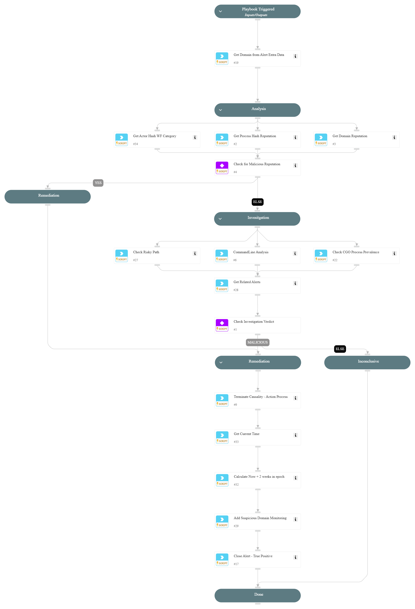

This playbook addresses the following alerts:

- Recurring rare domain access from an uncommon unsigned process
- Recurring access to a rare domain associated with known threats

Playbook Stages:
  
Analysis:

- Check actor process hash reputation
- Check suspicious domain reputation
- Check actor process hash category using WildFire

  If suspicious/malicious reputation found:
    - Execute Remediation

Investigation:

- Check Actor for Risky Path
- Get Actor CommandLine Analysis
- Get CGO Process Prevalence
- Get Related Alerts

  If found related alerts and one other risk:
    - Execute Remediation

Containment:

- Kill CGO Process
- Add Domain IOC rule.

## Dependencies

This playbook uses the following sub-playbooks, integrations, and scripts.

### Sub-playbooks

This playbook does not use any sub-playbooks.

### Integrations

This playbook does not use any integrations.

### Scripts

* CommandLineAnalysis
* GetTime
* SearchIncidentsV2
* SetAndHandleEmpty

### Commands

* closeInvestigation
* core-api-post
* core-get-cloud-original-alerts
* core-get-process-analytics-prevalence
* core-terminate-causality
* domain
* file
* wildfire-get-verdict

## Playbook Inputs

---
There are no inputs for this playbook.

## Playbook Outputs

---
There are no outputs for this playbook.

## Playbook Image

---

