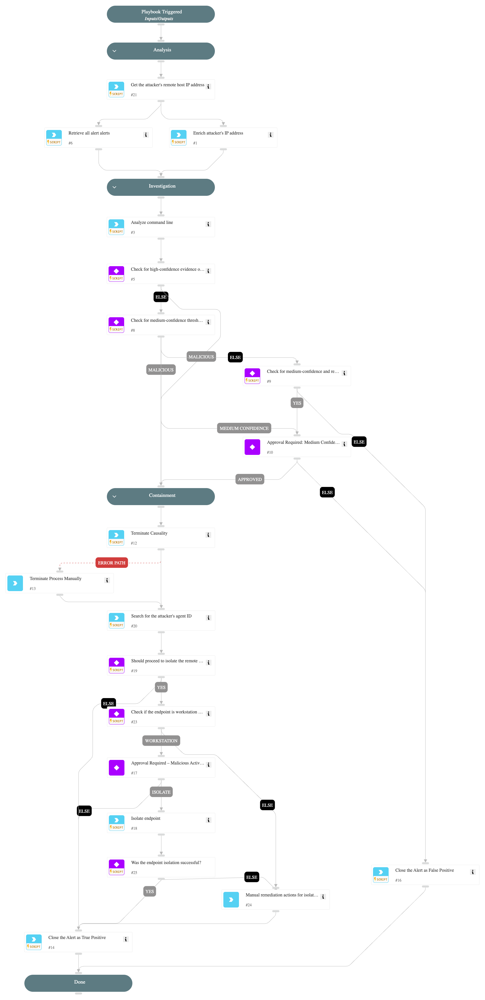

This playbook addresses the following alerts:

* Remote WMI process execution
* Suspicious remote WMI process execution

**Playbook Stages:**

**Analysis:**

* Enrich the attacker’s IP address to identify any known malicious activity.

* Retrieve all incident-related alerts to consolidate context for further analysis.

**Investigation:**

* Analyze command-line activity to assess risks based on suspicious patterns.

* Check for high-confidence evidence, such as malicious IP addresses or suspicious command-line activity, to determine the next course of action.

* Evaluate medium-confidence detections and request analyst approval for further containment if required.

**Containment:**

* Attempt to terminate the malicious process tree using its causality ID.

* Provide guidance for manual process termination if the automated action fails.

* Propose endpoint isolation to prevent further compromise if malicious activity is confirmed.

## Dependencies

This playbook uses the following sub-playbooks, integrations, and scripts.

### Sub-playbooks

This playbook does not use any sub-playbooks.

### Integrations

This playbook does not use any integrations.

### Scripts

* CommandLineAnalysis
* SearchIncidentsV2

### Commands

* closeInvestigation
* core-get-cloud-original-alerts
* core-get-endpoints
* core-isolate-endpoint
* core-terminate-causality
* ip

## Playbook Inputs

---
There are no inputs for this playbook.

## Playbook Outputs

---
There are no outputs for this playbook.

## Playbook Image

---

