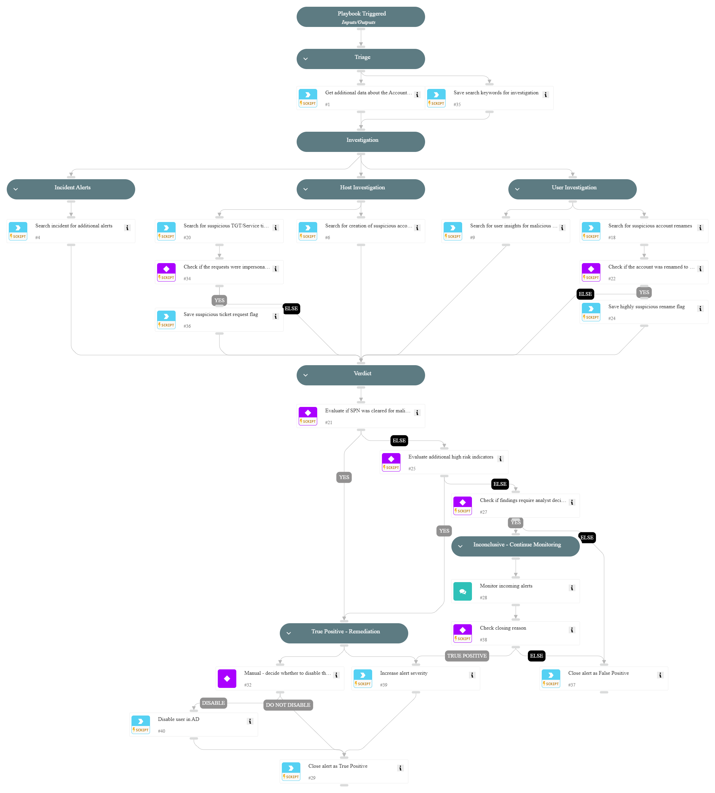

This playbook addresses the following alerts:

- SPNs cleared from a machine account
- SPNs cleared from a machine account for the first time

Playbook Stages:

Triage:

- Retrieve additional data about the Account Changed event, including the Machine Account whose SPNs were cleared and the number of times the user cleared SPNs in the last 30 days.
Investigation:

- Search for creation of suspicious account on the Domain Controller.
- Search for suspicious TGT/Service ticket requests.
- Search for user insights associated with malicious tools related to Kerberos ticket manipulation.
- Search for suspicious account renames, particularly to mimic DC name.
- Search for additional alerts in the incident that could indicate attempts to find controlled accounts or create accounts.

Containment:

- For alerts determined to be true positives, prompt the analyst to decide whether to disable the user account.
- Upon analyst approval: Disable the suspicious user account in Active Directory.

Requirements:

For response actions, you need the following integrations:

- Active Directory Query v2.

## Dependencies

This playbook uses the following sub-playbooks, integrations, and scripts.

### Sub-playbooks

This playbook does not use any sub-playbooks.

### Integrations

This playbook does not use any integrations.

### Scripts

* IncreaseAlertSeverity
* SearchAlertsV2
* Set
* SetAndHandleEmpty
* disable-user

### Commands

* closeInvestigation
* core-get-cloud-original-alerts

## Playbook Inputs

---
There are no inputs for this playbook.

## Playbook Outputs

---
There are no outputs for this playbook.

## Playbook Image

---

