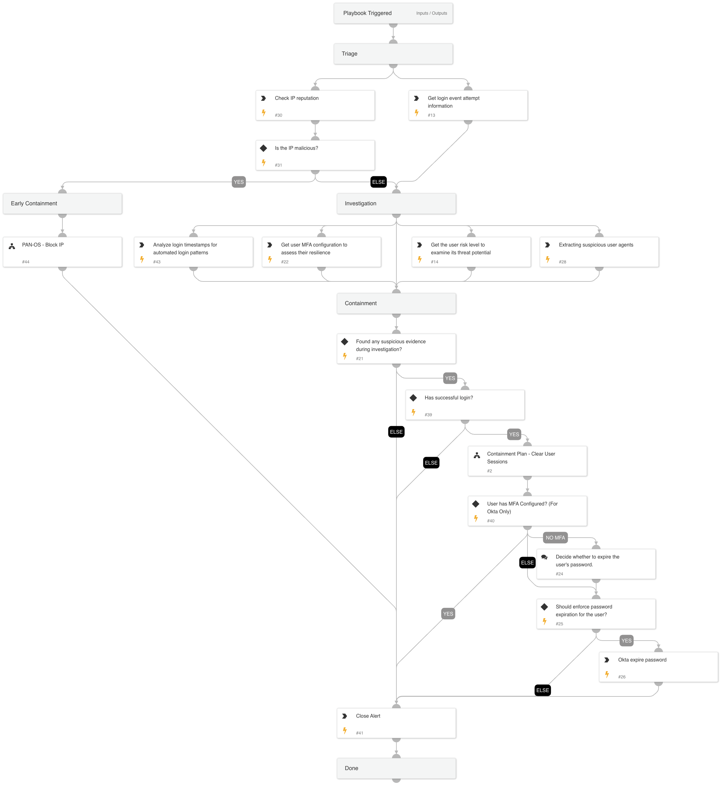

This playbook addresses the following alerts:

- SSO Brute Force Threat Detected
- SSO Brute Force Activity Observed

Playbook Stages:

Triage:

- The playbook checks the IP reputation and fetches the events related to the brute force login attempts.

Early Containment:

- The playbook checks if the IP is suspicious. If it is, the playbook suggests blocking the IP using PAN-OS. The investigation continues in parallel to this phase.

Investigation:

- The playbook assesses the risk score of the user who successfully logged in after a brute force attempt, examines the legitimacy of the user agent and if the brute force attempt is likely automated based on the timestamp interval. It also verifies if the user has MFA configured when the alert source is Okta.

Containment:
- If there is a successful login attempt and the user's risk score is high, or if the user agent is detected as suspicious, or if the time intervals indicates that the login attempts is likely automated, the playbook clears the user's session. If the user doesn't have MFA configured, the playbook recommends expiring the user's password. If there is no successful login detected, no action is taken.

Requirements:

For any response action, you need one of the following integrations:

- Microsoft Graph User
- Okta v2

For eradication step,  you need the following integration:

- Palo Alto Networks PAN-OS.

## Dependencies

This playbook uses the following sub-playbooks, integrations, and scripts.

### Sub-playbooks

* Containment Plan - Clear User Sessions
* PAN-OS - Block IP

### Integrations

* Cortex Core - IR

### Scripts

* MatchRegexV2
* AnalyzeTimestampIntervals

### Commands

* core-get-cloud-original-alerts
* okta-expire-password
* okta-get-user-factors
* core-list-risky-users
* ip
* closeInvestigation

## Playbook Inputs

---
There are no inputs for this playbook.

## Playbook Outputs

---
There are no outputs for this playbook.

## Playbook Image

---

