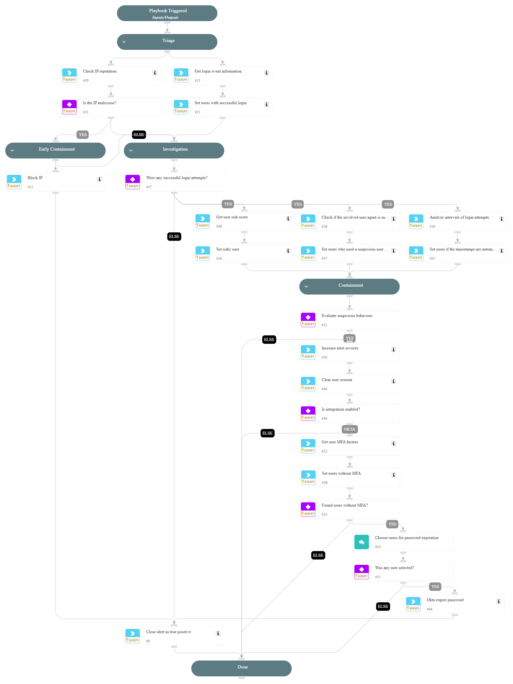

This playbook is designed to handle the following alerts:

- SSO Password Spray Threat Detected
- SSO Password Spray Activity Observed
- SSO Password Spray Involving a Honey User

Playbook Stages:

Triage:

- The playbook checks the IP reputation and fetches the events related to the SSO login attempts.

Early Containment:

- The playbook checks if the IP is suspicious. If it is, the playbook suggests blocking the IP.

Investigation:

- The playbook assess the risk score of the user who successfully logged in and examines the legitimacy of the user agent. It verifies if the user has MFA configured and analyzes the timestamps of the login attempts to detect potential malicious automated patterns.

Containment:
- If there is a successful login attempt and the user's risk score is high, or if the user agent is detected as suspicious, or if the time intervals were automated, the playbook clears the user's session. If the user doesn't have MFA, the playbook recommends expiring the user's password.

Requirements:

For any response action, you need one of the following integrations:

- Microsoft Graph User
- Okta

## Dependencies

This playbook uses the following sub-playbooks, integrations, and scripts.

### Sub-playbooks

* Containment Plan - Clear User Sessions
* PAN-OS - Block IP

### Integrations

* CoreIOCs
* CortexCoreIR
* CortexCoreXQLQueryEngine

### Scripts

* AnalyzeTimestampIntervals
* SetAndHandleEmpty

### Commands

* closeInvestigation
* core-get-cloud-original-alerts
* core-list-risky-users
* ip
* okta-expire-password
* okta-get-user-factors

## Playbook Inputs

---
There are no inputs for this playbook.

## Playbook Outputs

---
There are no outputs for this playbook.

## Playbook Image

---

