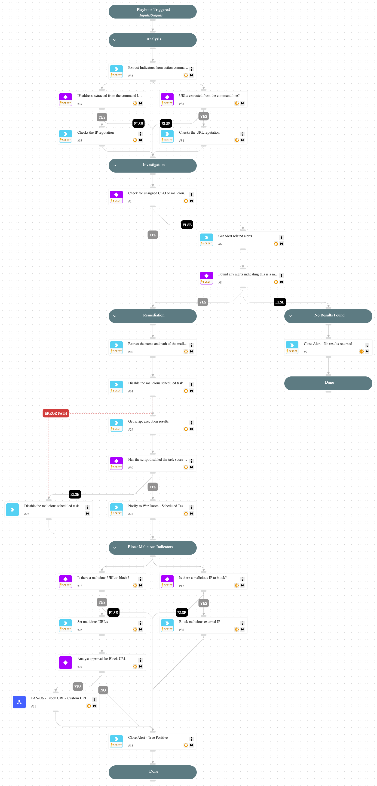

This playbook is designed to handle the alert "Scheduled task created with HTTP or FTP reference".

The playbook executes the following stages:

Analysis:
- Extracts the Indicators from action command line
- Checks the IP and the URL reputation.

Investigation:
During the alert investigation, the playbook will perform the following:
- Checks if the IP and the URL reputation is malicious.
- Checks the CGO process is unsigned.
- Searches for related alerts to determine if the creation of the scheduled task is part of an attack pattern.

Remediation:
- Remediation actions will be taken if the CGO process is unsigned, the IP or URL has a malicious reputation, or a related alert is detected. In these cases, the playbook will disable the scheduled task, block the malicious indicators, and close the alert.

Requires: To block the malicious URL, configure the 'Palo Alto Networks PAN-OS' integration.

## Dependencies

This playbook uses the following sub-playbooks, integrations, and scripts.

### Sub-playbooks

* PAN-OS - Block URL - Custom URL Category

### Integrations

This playbook does not use any integrations.

### Scripts

* Print
* SearchAlertsV2
* Set
* SetAndHandleEmpty
* block-external-ip

### Commands

* closeInvestigation
* core-get-script-execution-results
* core-run-script-execute-commands
* extractIndicators
* ip
* url

## Playbook Inputs

---
There are no inputs for this playbook.

## Playbook Outputs

---
There are no outputs for this playbook.

## Playbook Image

---

