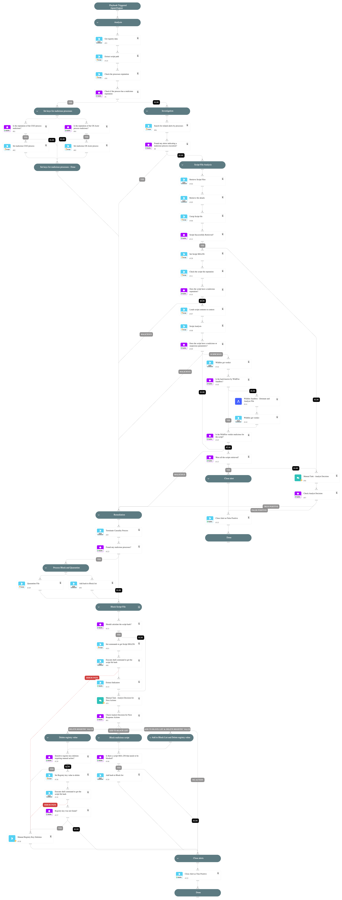

This playbook handles "Script file added to startup-related Registry keys" alerts.

Playbook Stages:

Analysis:

- Extract the script path from the registry key value.
- Check the reputation of the associated processes.

Investigation:

- Searches for related Cortex XSIAM alerts to identify potential attack patterns.
- Retrieves the script file and relevant details for investigation.
- Analyzes the script for malicious or suspicious parameters:
  - If malicious parameters are found, proceed to remediation.
  - If suspicious parameters are found, detonate and analyze the script using WildFire Sandbox.
- Checks the script file reputation.
- Detonates and analyzes the script using WildFire Sandbox.

Remediation:

- Terminates the malicious process.
- Quarantines the malicious process.
- Adds the malicious process hash to the blocklist.
- Calculates the script file’s SHA256 hash if not already available.
- Deletes the Registry key value (Requires analyst approval).
- Adds the script file hash to the blocklist (Requires analyst approval).
- Automatically close the alert.

## Dependencies

This playbook uses the following sub-playbooks, integrations, and scripts.

### Sub-playbooks

* Wildfire Sandbox - Detonate and Analyze File

### Integrations

This playbook does not use any integrations.

### Scripts

* CommandLineAnalysis
* MatchRegexV2
* ReadFile
* SearchAlertsV2
* Set
* SetAndHandleEmpty
* SetMultipleValues
* UnzipFile
* file-enrichment
* quarantine-file

### Commands

* closeInvestigation
* core-blocklist-files
* core-execute-command
* core-get-cloud-original-alerts
* core-retrieve-file-details
* core-retrieve-files
* core-terminate-causality
* extractIndicators
* wildfire-get-verdict

## Playbook Inputs

---
There are no inputs for this playbook.

## Playbook Outputs

---
There are no outputs for this playbook.

## Playbook Image

---

