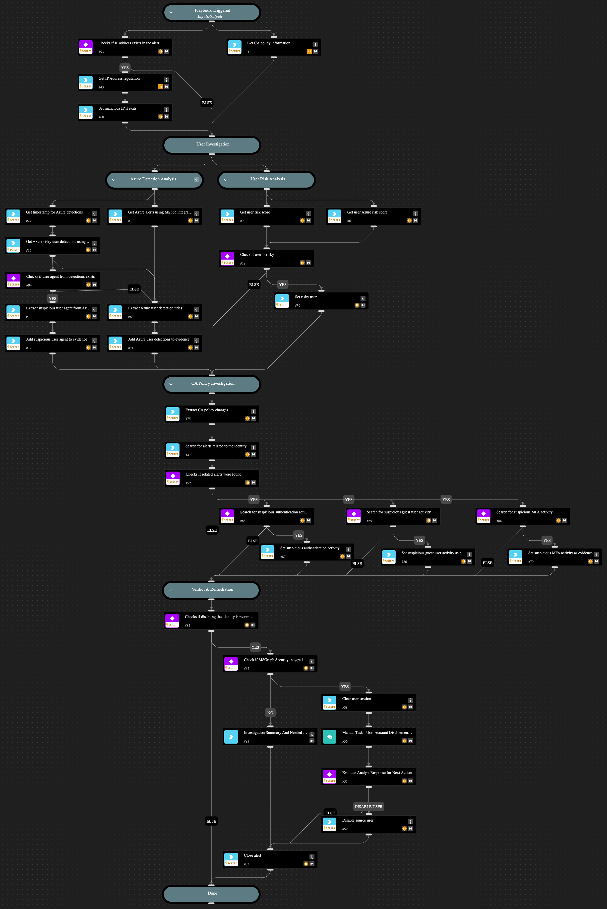

**This playbook addresses the following alert**:
- Suspicious Conditional Access operation for an identity

**Playbook Stages**:

**Triage**:
- Gather initial information about the initiating user.
**User Investigation**:
- **IP Enrichment**:
  - Analyze the reputation of the initiating user IP addresses.
- **Azure Detection Analysis**:
  - Investigate recent Azure security alerts for the initiating user to detect additional suspicious activity.
  - If any detections found, investigate the related user agent.
- **User Risk Analysis**:
  - Assess the risk level of the initiating user based on XSIAM Core and Azure risk score.
  - Investigate reasons behind any identified risks, including recent detections.
- **Attacker Geolocation Analysis**:
  - Investigate the initiating user connection geolocation.
- **Insights Analysis**:
  - Investigate the XSIAM insights that related to the initiating user to detect additional suspicious activity.

**User Investigation**:
- **Search for suspicious MFA activity**:
  - Search for a policy change that indicates on disabling the need in MFA
- **Search for suspicious guest user activity**:
  - Search for a policy change that indicates on allowing
**Verdict & Containment**:
- If any suspicious evidence found during the user investigation phase and the integration "Microsoft Graph User" integration is enabled, the playbook will revoke the sessions of the initiating user and the destination user. If the integration is not enabled, the playbook will recommend to perform the same action but manually.
- If the initiating user IP is malicious, or the initiating user risk is HIGH, or more than one suspicious evidence found during the Azure detection analysis and the CA policy investigation phase, and the integration "Microsoft Graph User" is enabled, the playbook will revoke the sessions of the initiating user and the destination user and will recommend manually to disable either one of the users or both of the users. If the integration is not enabled, the playbook will recommend to perform the same action but manually.

**Requirements**:
- `Azure Risky Users` for retrieving user risk scores.
- `Microsoft 365 Defender` for advanced hunting queries and Azure security alerts.
- `Microsoft Graph User` for disabling accounts and revoking sessions.

## Dependencies

This playbook uses the following sub-playbooks, integrations, and scripts.

### Sub-playbooks

This playbook does not use any sub-playbooks.

### Integrations

This playbook does not use any integrations.

### Scripts

* GetTime
* IsIntegrationAvailable
* JSONDiff
* MatchRegexV2
* SearchAlertsV2
* SetAndHandleEmpty

### Commands

* azure-risky-users-list
* azure-risky-users-risk-detections-list
* closeInvestigation
* core-get-cloud-original-alerts
* core-list-risky-users
* ip
* microsoft-365-defender-advanced-hunting
* msgraph-user-account-disable
* msgraph-user-session-revoke

## Playbook Inputs

---
There are no inputs for this playbook.

## Playbook Outputs

---
There are no outputs for this playbook.

## Playbook Image

---

