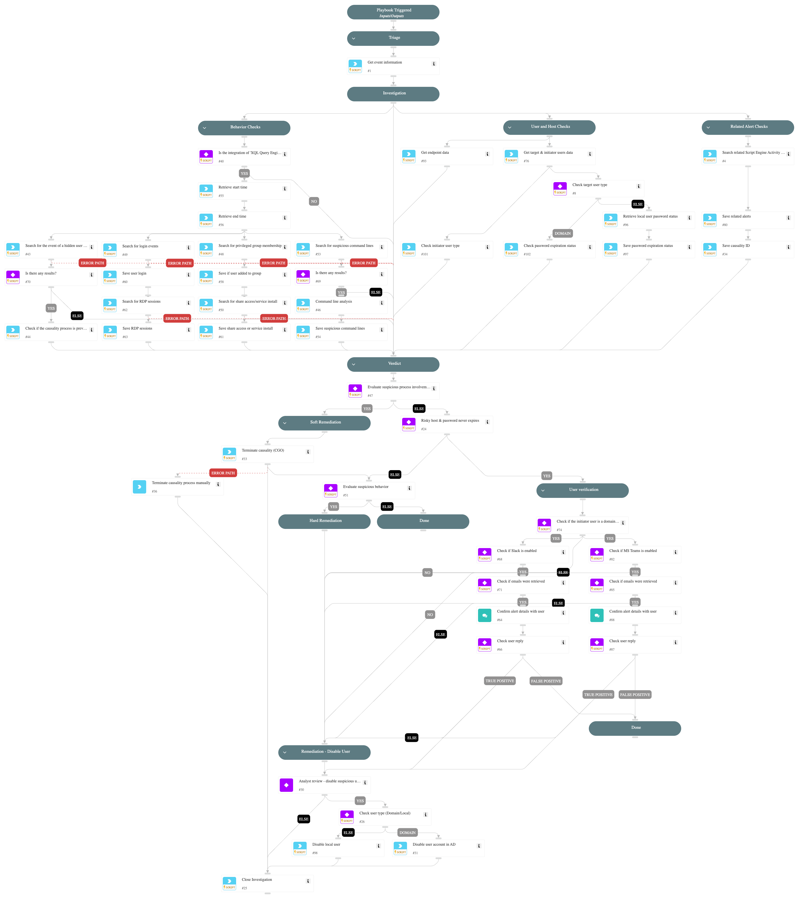

This playbook addresses the following alerts:

  - Suspicious Hidden User Created

  Playbook Stages:

  Triage:
  - Retrieve event information about the created user

  Investigation:
  - Check whether the user account is local or domain-based.
  - For domain users: Retrieve AD attributes, including password expiration.
  - For local users: Run a Powershell command to get "Password Expires" attribute of the local user.
  - Retrieve the risk level for the affected host.
  - Search for related Script Engine Activity alerts in the incident.
  - Check for suspicious command lines executed on the host.
  - Search for privileged group membership changes.
  - Check for authentication logs of the hidden user.
  - Monitor for suspicious share access or service installations.
  - Search for RDP sessions related to the hidden user.

  Containment:
  - For risky hosts with suspicious users that have non-expiring passwords, perform soft remediation by terminating causality processes.
  - For alerts showing clear malicious behavior patterns, perform hard remediation.
  - For alerts confirmed as true positives, ask the analyst to disable the user.
  - Upon receiving the analyst's approval, disable the suspicious user account (domain or local).
  - If a related alert about malicious activity exists, kill the Causality Group Owner (CGO) process that created the suspicious user.

  Requirements:
  For response actions, you need the following integrations:
  - Cortex Core - Investigation and Response
  - Active Directory Query v2 (for domain user actions)
  - XQL Query Engine (for enhanced investigation)
  - SlackV3 or Microsoft Teams (optional, for user verification).

## Dependencies

This playbook uses the following sub-playbooks, integrations, and scripts.

### Sub-playbooks

This playbook does not use any sub-playbooks.

### Integrations

This playbook does not use any integrations.

### Scripts

* CommandLineAnalysis
* IsIntegrationAvailable
* SearchAlertsV2
* Set
* SetAndHandleEmpty
* disable-user
* get-endpoint-data
* get-user-data

### Commands

* closeInvestigation
* core-execute-command
* core-get-cloud-original-alerts
* core-get-process-analytics-prevalence
* core-terminate-causality
* xdr-xql-generic-query

## Playbook Inputs

---
There are no inputs for this playbook.

## Playbook Outputs

---
There are no outputs for this playbook.

## Playbook Image

---

