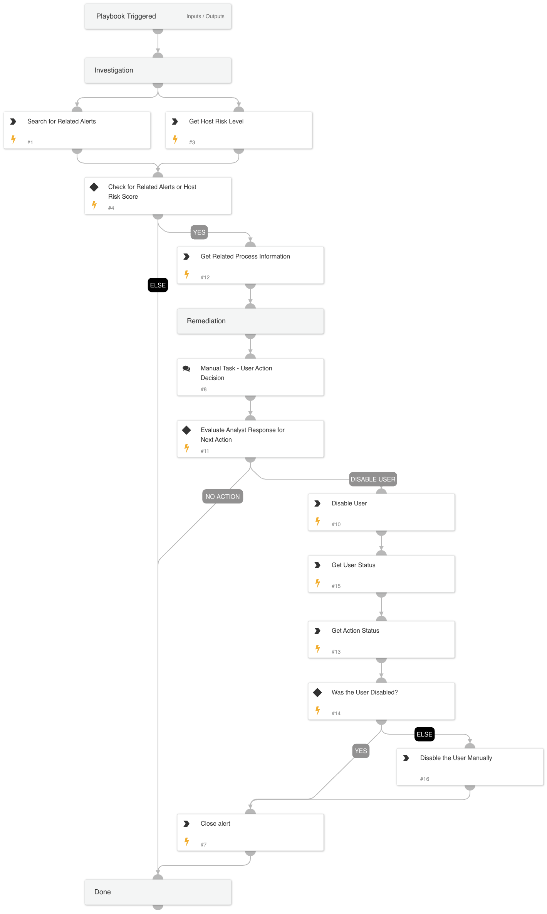

This playbook addresses the following alerts:
 
- Suspicious local administrator login
 
Playbook Stages:
 
Investigation:
 
- Retrieves the name of the process image involved in the alert.
- Checks for related Powershell/Command and Scripting/WMI alerts in the incident.
- Retrieves the host risk score.
 
Containment:
 
- Provide a manual task for an analyst to review the findings and decide the next steps.
- Possible actions:
  - Disable user.
  - Take no action.
 
Requirements: 

- For response actions, the following integration is required: Core - IR.

## Dependencies

This playbook uses the following sub-playbooks, integrations, and scripts.

### Sub-playbooks

This playbook does not use any sub-playbooks.

### Scripts

* SearchAlertsV2

### Commands

* closeInvestigation
* core-get-cloud-original-alerts
* core-get-script-execution-results
* core-list-risky-hosts
* core-run-script-execute-commands

## Playbook Inputs

---
There are no inputs for this playbook.

## Playbook Outputs

---
There are no outputs for this playbook.

## Playbook Image

---

