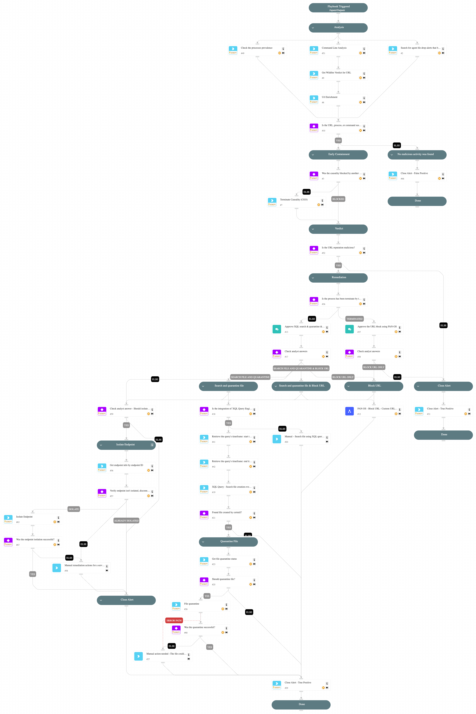

This playbook handles "Suspicious certutil command line" alerts.

Playbook Stages:

Analysis:

During the alert analysis, the playbook will perform the following actions:

- Extracts and enriches the URL from the command line.
- Checks if the URL reputation is suspicious.
- Checks if any process in the causality chain is unsigned.
- Checks if any process in the causality chain is non-prevalent.
- Searches for Cortex XDR agent alerts related to file drops using certutil.
- Checks for any suspicious parameters in the command line (if the command line risk score is medium or higher).

If the playbook detects any of these conditions, it will proceed to the early containment stage; otherwise, it will close the alert.

Early Containment:

- Identify if an agent prevention rule was triggered. If triggered in **block mode**, proceed with the URL reputation check; otherwise, terminate the causality process tree.

Verdict:

- Based on the URL's reputation, if found to be malicious, the playbook will perform remediation actions; otherwise, it will close the alert.

Remediation:

If the URL is found to have a malicious reputation, the playbook will perform the following actions:

- Block the malicious URL using PAN-OS (requires analyst approval).
- Isolate the endpoint (requires analyst approval).
- Execute an XQL query to check for file creation events by the certutil process, and if a file is found, quarantine it (requires analyst approval).
- Automatically close the alert.

Required Integrations:

For response actions, you need the following integrations:

- Palo Alto Networks PAN-OS
- XQL Query Engine.

## Dependencies

This playbook uses the following sub-playbooks, integrations, and scripts.

### Sub-playbooks

* PAN-OS - Block URL - Custom URL Category

### Integrations

This playbook does not use any integrations.

### Scripts

* CommandLineAnalysis
* IsIntegrationAvailable
* SearchIncidentsV2
* Set

### Commands

* closeInvestigation
* core-get-endpoints
* core-get-process-analytics-prevalence
* core-get-quarantine-status
* core-isolate-endpoint
* core-quarantine-files
* core-terminate-causality
* url
* wildfire-get-verdict
* xdr-xql-generic-query

## Playbook Inputs

---
There are no inputs for this playbook.

## Playbook Outputs

---
There are no outputs for this playbook.

## Playbook Image

---

