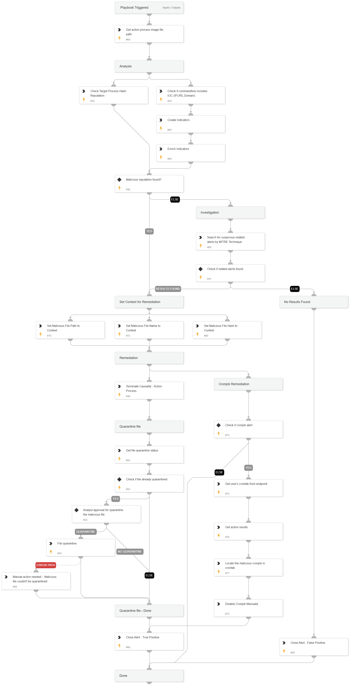

This playbook addresses the following alerts for linux os:

- Suspicious process execution from tmp folder
- Suspicious interactive execution of a binary from the tmp folder
- Suspicious cron job task execution of a binary from the tmp folder
- A web server process executed an unpopular application from the tmp folder

Playbook Stages:

Analysis:

- Check target process hash reputation
- Check commandline extracted indicators reputation

The playbook will proceed directly to remediation if suspicious/Suspicious reputation is found during the analysis stage.

Investigation:

- Search for the following suspicious insights/related alerts:
  - Suspicious access to shadow file
  - UNIX LOLBIN process connected to a rare external host
  - Persistence through service registration
  - Adding execution privileges    
  - Modification of systemd service files
  - Adding execution privileges
  - Local account discovery

If no suspicious reputation is found in the analysis stage, but suspicious insights/related alerts are discovered during investigation, the playbook will then proceed to remediation.

Remediation:

- Terminate causality process
- Quarantine the Suspicious process image file (requires manual approval).
- Disable the suspicious cron job task (requires manual action).

## Dependencies

This playbook uses the following sub-playbooks, integrations, and scripts.

### Sub-playbooks

* Entity Enrichment - Generic v3

### Integrations

This playbook does not use any integrations.

### Scripts

* SearchIncidentsV2
* SetAndHandleEmpty

### Commands

* closeInvestigation
* core-get-cloud-original-alerts
* core-get-quarantine-status
* core-get-script-execution-results
* core-quarantine-files
* core-run-script-execute-commands
* core-terminate-causality
* extractIndicators
* file

## Playbook Inputs

---
There are no inputs for this playbook.

## Playbook Outputs

---
There are no outputs for this playbook.

## Playbook Image

---

