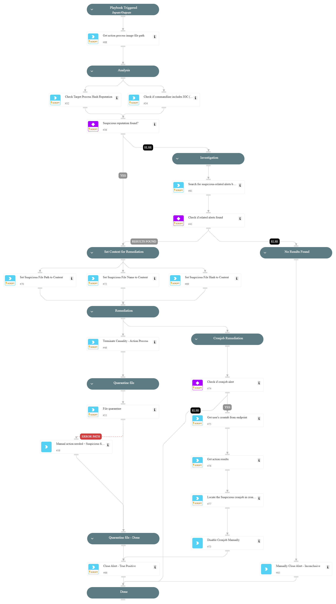

This playbook addresses the following alerts:
 
- Suspicious interactive execution of a binary from the tmp folder
- Suspicious cron job task execution of a binary from the tmp folder
- A web server process executed an unpopular application from the tmp folder
 
Playbook Stages:
  
Analysis: 
 
- Check target process hash reputation
- Check commandline extracted indicators reputation
 
Investigation:
 
- Search for suspicious related alerts
 
Remediation:
 
- Terminate causality process
- Quarantine the malicious process image file.

## Dependencies

This playbook uses the following sub-playbooks, integrations, and scripts.

### Sub-playbooks

This playbook does not use any sub-playbooks.

### Integrations

This playbook does not use any integrations.

### Scripts

* SearchIncidentsV2
* SetAndHandleEmpty

### Commands

* closeInvestigation
* core-get-cloud-original-alerts
* core-get-quarantine-status
* core-get-script-execution-results
* core-quarantine-files
* core-run-script-execute-commands
* core-terminate-causality
* createNewIndicator
* enrichIndicators
* extractIndicators
* file

## Playbook Inputs

---
There are no inputs for this playbook.

## Playbook Outputs

---
There are no outputs for this playbook.

## Playbook Image

---

