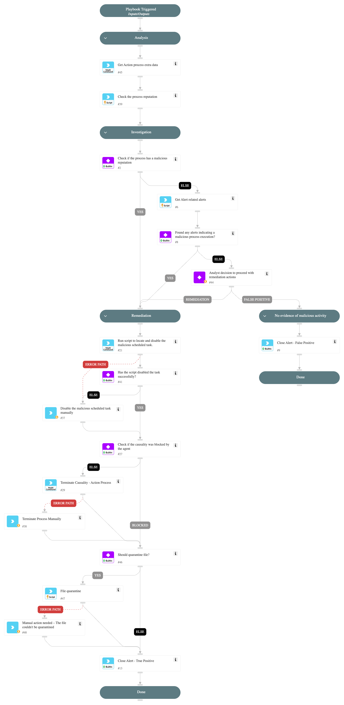

This playbook handles "Suspicious process execution by scheduled task on a sensitive server" alerts.

Playbook Stages:

Analysis:

- Checks the suspicious process reputation.

Investigation:

- Searches for related XSIAM agent alerts to identify any malicious activity on the server.

Remediation:

If the suspicious process reputation is malicious, or if a related alert is found, the following remediation actions will be taken:

- Disable the scheduled task responsible for executing the process.
- Terminate the malicious process.
- Automatically Close the alert.

## Dependencies

This playbook uses the following sub-playbooks, integrations, and scripts.

### Sub-playbooks

This playbook does not use any sub-playbooks.

### Integrations

* CoreIOCs
* CortexCoreIR
* CortexCoreXQLQueryEngine

### Scripts

* SearchIncidentsV2

### Commands

* closeInvestigation
* core-get-script-execution-results
* core-run-script-execute-commands
* core-terminate-causality
* file

## Playbook Inputs

---
There are no inputs for this playbook.

## Playbook Outputs

---
There are no outputs for this playbook.

## Playbook Image

---

