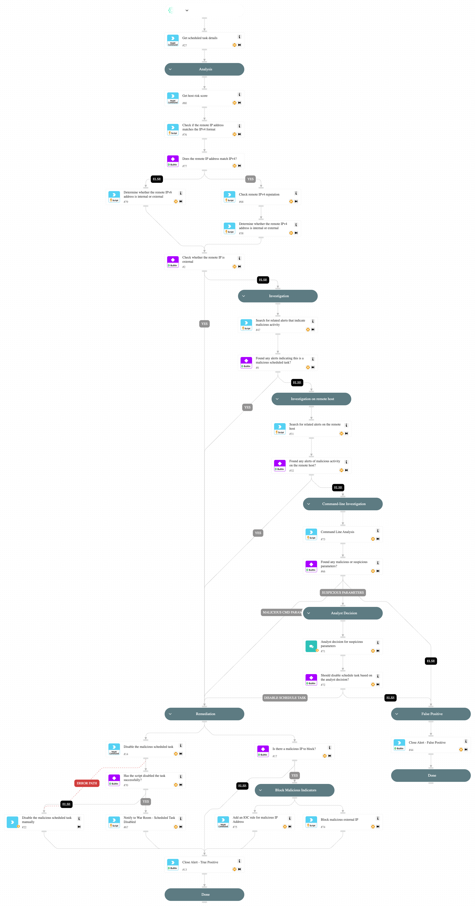

This playbook handles "Uncommon remote scheduled task created" alerts.

Playbook Stages:

Analysis:

- The playbook checks if the remote IP is external or has a bad reputation.

Investigation:
During the alert investigation, the playbook will perform the following:

- Searches for related XSIAM alerts on the endpoint that use the following MITRE techniques to identify malicious activity: T1202 - Indirect Command Execution, T1021 - Remote Services.
- Searches for related XSIAM agent alerts on the remote endpoint, to determine if the creation of the scheduled task is part of an attack pattern.
- Searches for suspicious command-line parameters indicating a malicious scheduled task.

Remediation:

- Automatically disable the malicious scheduled task.
- Block the malicious IP (requires analyst approval).
- Automatically Close the alert.

Requirements:

For response actions, the following integrations are required: 

- PAN-OS.

## Dependencies

This playbook uses the following sub-playbooks, integrations, and scripts.

### Sub-playbooks

* Command-Line Analysis
* PAN-OS - Block IP

### Integrations

* CoreIOCs
* CortexCoreIR
* CortexCoreXQLQueryEngine

### Scripts

* IsIPInRanges
* Print
* SearchIncidentsV2

### Commands

* closeInvestigation
* core-get-cloud-original-alerts
* core-get-script-execution-results
* core-run-script-execute-commands
* ip

## Playbook Image

---

